# Complete CI/CD Flow - KARS

End-to-end continuous integration and deployment pipeline for KARS.

```mermaid
flowchart TB
    subgraph Developer["👨‍💻 Developer Workstation"]
        A[Create Feature Branch<br/>feature/new-feature] --> B[Write Code]
        B --> C[Run Local Tests<br/>npm test]
        C --> D[Commit & Push]
    end
    
    subgraph GitHub["📦 GitHub Repository humac/acs"]
        D --> E[Create Pull Request<br/>feature/* → kars-dev]
        E --> F{Code Review<br/>Approved?}
        F -->|No| G[Request Changes]
        G --> B
        F -->|Yes| H[Merge to kars-dev]
    end
    
    subgraph CICD["⚙️ GitHub Actions CI/CD"]
        H --> I[Trigger CI Pipeline]
        I --> J[Install Dependencies<br/>npm ci]
        J --> K[Run Linters<br/>eslint]
        K --> L[Run Tests<br/>Backend: Jest<br/>Frontend: Vitest]
        L --> M{All Tests<br/>Pass?}
        M -->|No| N[❌ Build Failed]
        N --> O[Notify in #kars-support]
        M -->|Yes| P[✅ Build Success]
    end
    
    subgraph RailwayDev["🚂 Railway Development"]
        P --> Q[Auto-Deploy Triggered<br/>kars-dev branch]
        Q --> R[Build Services]
        R --> S1[Build Backend]
        R --> S2[Build Frontend]
        S1 --> T1[Deploy kars-backend-dev]
        S2 --> T2[Deploy kars-frontend-dev]
        T1 --> U[Health Check<br/>/api/health]
        T2 --> U
        U --> V{Deployment<br/>Successful?}
        V -->|No| W[❌ Rollback]
        W --> X[Alert #kars-incidents]
        V -->|Yes| Y[✅ Dev Environment Ready]
    end
    
    subgraph QA["🧪 QA Testing - Friday"]
        Y --> Z[QA Team Tests<br/>kars-dev.keydatalab.ca]
        Z --> AA[Functional Testing]
        Z --> AB[Performance Testing]
        Z --> AC[Security Testing]
        AA --> AD{All Tests<br/>Pass?}
        AB --> AD
        AC --> AD
        AD -->|No| AE[Create Bug Tickets]
        AE --> B
        AD -->|Yes| AF[✅ QA Approved]
    end
    
    subgraph Release["📋 Monday Release - 10:00 AM EST"]
        AF --> AG[Code Freeze Complete]
        AG --> AH[Create PR<br/>kars-dev → kars-prod]
        AH --> AI[Team Review]
        AI --> AJ[Merge to kars-prod]
        AJ --> AK[Post in #kars-releases<br/>Deployment Starting]
    end
    
    subgraph RailwayProd["🚀 Railway Production"]
        AK --> AL[Auto-Deploy Triggered<br/>kars-prod branch]
        AL --> AM[Build Services]
        AM --> AN1[Build Backend]
        AM --> AN2[Build Frontend]
        AN1 --> AO1[Deploy kars-backend-prod]
        AN2 --> AO2[Deploy kars-frontend-prod]
        AO1 --> AP[Health Check<br/>kars.keydatalab.ca/api/health]
        AO2 --> AP
        AP --> AQ{Deployment<br/>Successful?}
        AQ -->|No| AR[❌ Immediate Rollback]
        AR --> AS[Alert #kars-incidents<br/>Execute Rollback Plan]
        AQ -->|Yes| AT[✅ Production Live]
    end
    
    subgraph Monitoring["📊 Post-Deployment"]
        AT --> AU[Monitor for 30 Minutes]
        AU --> AV[Check Error Rates]
        AU --> AW[Check Performance]
        AU --> AX[Monitor User Feedback]
        AV --> AY{All Metrics<br/>Normal?}
        AW --> AY
        AX --> AY
        AY -->|No| AZ[Investigate & Fix<br/>or Rollback]
        AY -->|Yes| BA[✅ Release Complete]
        BA --> BB[Post in #kars-releases<br/>Deployment Successful]
    end
    
    style A fill:#e3f2fd
    style P fill:#c8e6c9
    style Y fill:#c8e6c9
    style AF fill:#c8e6c9
    style AT fill:#c8e6c9
    style BA fill:#4caf50
    style N fill:#ffcdd2
    style W fill:#ffcdd2
    style AR fill:#ffcdd2
```

## Key Points

### Branches
- **kars-dev** - Development/QA environment (kars-dev.keydatalab.ca)
- **kars-prod** - Production environment (kars.keydatalab.ca)
- **feature/** - Developer feature branches

### Automated Steps
- GitHub Actions CI runs on every PR
- Railway auto-deploys on push to kars-dev/kars-prod
- Health checks validate deployments
- Rollback automatic on health check failure

### Manual Steps
- Code review and PR approval
- Friday QA testing on kars-dev
- Monday production release (10:00 AM EST)
- Post-deployment monitoring

### Communication
- **#kars-support** - Build failures, general issues
- **#kars-incidents** - Deployment failures, emergency rollbacks
- **#kars-releases** - Release announcements, deployment status

### Schedule
- **Thursday 5:00 PM** - Code freeze
- **Friday** - Full day QA on kars-dev
- **Monday 10:00 AM EST** - Production deployment
- **Monday 10:30 AM EST** - Release complete

---

**Last Updated:** January 2025  
**Related:** [Railway Auto-Deploy](06-railway-auto-deploy.md), [Weekly Release Cycle](04-weekly-release-cycle.md)
