# Feature Development Workflow - KARS

Standard workflow for developing and deploying new features.

```mermaid
flowchart TB
    subgraph Planning["📋 Planning"]
        A[Create GitHub Issue] --> B[Assign to Developer]
        B --> C[Define Acceptance Criteria]
    end
    
    subgraph Development["👨‍💻 Development"]
        C --> D[Checkout kars-dev<br/>git checkout kars-dev]
        D --> E[Create Feature Branch<br/>git checkout -b feature/ISSUE-123-description]
        E --> F[Implement Feature]
        F --> G[Write Tests]
        G --> H[Run Tests Locally<br/>npm test]
        H --> I{Tests<br/>Pass?}
        I -->|No| F
        I -->|Yes| J[Commit Changes<br/>git commit -m 'feat: description']
        J --> K[Push Branch<br/>git push origin feature/ISSUE-123]
    end
    
    subgraph PR["🔄 Pull Request"]
        K --> L[Create PR<br/>feature/* → kars-dev]
        L --> M[Fill PR Template<br/>- Description<br/>- Testing<br/>- Screenshots]
        M --> N[Request Reviewers]
        N --> O[GitHub Actions CI<br/>Runs Automatically]
        O --> P{CI<br/>Pass?}
        P -->|No| Q[Fix Issues]
        Q --> F
        P -->|Yes| R[Await Code Review]
    end
    
    subgraph Review["👥 Code Review"]
        R --> S[Reviewer Checks Code]
        S --> T{Changes<br/>Needed?}
        T -->|Yes| U[Request Changes]
        U --> F
        T -->|No| V[Approve PR]
        V --> W[Merge to kars-dev<br/>Squash & Merge]
    end
    
    subgraph AutoDeploy["🚂 Railway Auto-Deploy"]
        W --> X[Railway Detects Push<br/>to kars-dev]
        X --> Y[Build & Deploy<br/>kars-backend-dev<br/>kars-frontend-dev]
        Y --> Z{Deploy<br/>Success?}
        Z -->|No| AA[Alert #kars-incidents]
        AA --> AB[Investigate & Fix]
        Z -->|Yes| AC[✅ Deployed to Dev<br/>kars-dev.keydatalab.ca]
    end
    
    subgraph Testing["🧪 Testing on Dev"]
        AC --> AD[Developer Tests Feature<br/>on kars-dev environment]
        AD --> AE[Share with QA Team]
        AE --> AF[QA Tests Feature]
        AF --> AG{Feature<br/>Works?}
        AG -->|No| AH[Create Bug Issue]
        AH --> F
        AG -->|Yes| AI[✅ Feature Complete]
    end
    
    subgraph WeeklyRelease["📦 Weekly Release Cycle"]
        AI --> AJ[Wait for Friday QA]
        AJ --> AK[Full Regression Testing]
        AK --> AL{QA<br/>Pass?}
        AL -->|No| AM[Fix Issues]
        AM --> F
        AL -->|Yes| AN[Include in Monday Release]
        AN --> AO[Merge kars-dev → kars-prod]
        AO --> AP[Deploy to Production<br/>kars.keydatalab.ca]
        AP --> AQ[✅ Feature Live in Production]
    end
    
    subgraph Cleanup["🧹 Cleanup"]
        AQ --> AR[Delete Feature Branch<br/>git branch -d feature/ISSUE-123]
        AR --> AS[Close GitHub Issue]
        AS --> AT[Update Documentation]
        AT --> AU[Post in #kars-releases]
    end
    
    style AC fill:#c8e6c9
    style AI fill:#c8e6c9
    style AQ fill:#4caf50
    style AA fill:#ffcdd2
```



## Best Practices

### Branch Naming
```bash
# Format: feature/ISSUE-123-short-description
feature/ISSUE-123-add-asset-export
feature/ISSUE-456-improve-login-ui
feature/ISSUE-789-fix-date-picker
```

### Commit Messages
Follow conventional commits:
```bash
feat: add CSV export for assets
fix: resolve date picker timezone issue
docs: update README with setup instructions
refactor: simplify authentication logic
test: add tests for asset CRUD operations
```

### PR Template
```markdown
## Description
Brief description of changes

## Related Issue
Closes #123

## Testing
- [ ] Unit tests added
- [ ] Integration tests pass
- [ ] Manual testing completed

## Screenshots
(if UI changes)
```

### Code Review Checklist
- [ ] Code follows style guide
- [ ] Tests cover new functionality
- [ ] No security vulnerabilities
- [ ] Performance acceptable
- [ ] Documentation updated
- [ ] No breaking changes (or documented)

---

## Timeline

### Typical Feature Timeline

| Phase | Duration | Details |
|-------|----------|---------|
| Planning | 1-2 days | Issue creation, assignment |
| Development | 2-5 days | Code, tests, local verification |
| PR Review | 1-2 days | Code review, revisions |
| Dev Deployment | 5 minutes | Automatic Railway deploy |
| Dev Testing | 1-2 days | QA validation |
| Wait for Release | 1-7 days | Included in next Monday release |
| Production | 30 minutes | Monday deployment window |
| **Total** | **1-3 weeks** | From planning to production |

---

## Exceptions

### Urgent Features
For time-critical features:
1. Create PR to kars-dev
2. Fast-track code review (same day)
3. Deploy to kars-dev immediately
4. QA tests on kars-dev
5. Create PR kars-dev → kars-prod (skip weekly cycle)
6. Deploy to production (outside Monday window)
7. Post in #kars-incidents (emergency deployment)

### Breaking Changes
For features with breaking changes:
1. Document all breaking changes in PR
2. Update migration guide
3. Notify all stakeholders in #kars-releases
4. Plan deployment during low-traffic hours
5. Have rollback plan ready
6. Extended monitoring after deployment

---

**Last Updated:** January 2025  
**Related:** [Weekly Release Cycle](04-weekly-release-cycle.md), [Branch Protection](07-branch-protection-approval.md)
