# Hotfix Workflow - KARS

Emergency procedure for fixing critical production issues.

```mermaid
flowchart TB
    subgraph Detection["🚨 Issue Detection"]
        A[Production Issue Detected] --> B{Severity?}
        B -->|P0 - Critical| C[Alert #kars-incidents<br/>Page On-Call]
        B -->|P1 - High| D[Post in #kars-incidents<br/>Assign Engineer]
        B -->|P2/P3| E[Create Issue<br/>Schedule for Release]
        E --> F[End - Not Hotfix]
    end
    
    subgraph Assessment["🔍 Assessment"]
        C --> G[On-Call Engineer Responds<br/>< 15 minutes]
        D --> G
        G --> H[Assess Impact<br/>- Users affected<br/>- Data at risk<br/>- Workarounds available]
        H --> I{Requires<br/>Immediate<br/>Fix?}
        I -->|No| J[Schedule for Monday Release]
        J --> F
        I -->|Yes| K[Proceed with Hotfix]
    end
    
    subgraph Preparation["📋 Preparation"]
        K --> L[Post in #kars-incidents<br/>HOTFIX INITIATED]
        L --> M[Backup Production Database<br/>railway run pg_dump]
        M --> N[Document Current State<br/>- Error logs<br/>- Affected users<br/>- Timestamps]
        N --> O[Identify Root Cause]
    end
    
    subgraph Development["👨‍💻 Hotfix Development"]
        O --> P[Checkout kars-prod<br/>git checkout kars-prod]
        P --> Q[Create Hotfix Branch<br/>git checkout -b hotfix/critical-issue]
        Q --> R[Implement Fix<br/>Minimal Changes Only]
        R --> S[Write Test for Fix]
        S --> T[Test Locally<br/>npm test]
        T --> U{Tests<br/>Pass?}
        U -->|No| R
        U -->|Yes| V[Commit Changes<br/>git commit -m 'hotfix: description']
    end
    
    subgraph FastTrack["⚡ Fast-Track Review"]
        V --> W[Push Branch<br/>git push origin hotfix/*]
        W --> X[Create PR<br/>hotfix/* → kars-prod]
        X --> Y[Request Emergency Review<br/>Post in #kars-incidents]
        Y --> Z[Senior Engineer Reviews<br/>Focus on: Safety, Scope, Testing]
        Z --> AA{Approved?}
        AA -->|No| AB[Fix Issues]
        AB --> R
        AA -->|Yes| AC[Merge to kars-prod<br/>Squash & Merge]
    end
    
    subgraph ProductionDeploy["🚀 Production Deployment"]
        AC --> AD[Railway Auto-Deploys<br/>kars-prod branch]
        AD --> AE[Monitor Deployment<br/>railway logs --follow]
        AE --> AF[Health Check<br/>curl kars.keydatalab.ca/api/health]
        AF --> AG{Deploy<br/>Success?}
        AG -->|No| AH[❌ Rollback Immediately<br/>railway rollback]
        AH --> AI[Investigate Failure]
        AI --> R
        AG -->|Yes| AJ[✅ Hotfix Deployed]
    end
    
    subgraph Verification["✅ Verification"]
        AJ --> AK[Test Fix in Production<br/>Verify issue resolved]
        AK --> AL[Monitor for 30 Minutes<br/>- Error rates<br/>- User feedback<br/>- Performance]
        AL --> AM{Fix<br/>Verified?}
        AM -->|No| AN[Issue Not Resolved<br/>Rollback or Additional Fix]
        AN --> R
        AM -->|Yes| AO[✅ Fix Confirmed]
    end
    
    subgraph Backport["🔄 Backport to Dev"]
        AO --> AP[Checkout kars-dev<br/>git checkout kars-dev]
        AP --> AQ[Merge Hotfix<br/>git merge hotfix/*]
        AQ --> AR[Push to kars-dev<br/>git push origin kars-dev]
        AR --> AS[Railway Auto-Deploys<br/>kars-dev updated]
        AS --> AT[Delete Hotfix Branch<br/>git branch -d hotfix/*]
    end
    
    subgraph PostMortem["📝 Post-Mortem"]
        AT --> AU[Update #kars-incidents<br/>HOTFIX COMPLETE]
        AU --> AV[Document Incident<br/>- Root cause<br/>- Resolution<br/>- Prevention]
        AV --> AW[Schedule Post-Mortem<br/>Within 48 hours]
        AW --> AX[Create Prevention Tasks]
        AX --> AY[✅ Incident Closed]
    end
    
    style AJ fill:#c8e6c9
    style AO fill:#c8e6c9
    style AY fill:#4caf50
    style AH fill:#ffcdd2
    style AN fill:#ffcdd2
```



## Hotfix Criteria

### When to Use Hotfix Workflow

**Immediate Hotfix Required (P0):**
- Complete service outage
- Data loss or corruption
- Security breach
- Payment processing broken
- Authentication system failure

**Fast-Track Hotfix (P1):**
- Core functionality unavailable
- Major feature broken for all users
- Severe performance degradation
- Database issues affecting operations

**Regular Release (P2/P3):**
- Minor bugs with workarounds
- UI/UX issues
- Non-critical feature failures
- Performance optimizations

---

## Timeline

### Emergency Hotfix Timeline

| Phase | Duration | Details |
|-------|----------|---------|
| **Detection → Assessment** | 15-30 min | Alert, respond, assess |
| **Preparation** | 10-15 min | Backup, document |
| **Development** | 30-60 min | Fix, test locally |
| **Fast-Track Review** | 15-30 min | Emergency review |
| **Deployment** | 5-10 min | Railway auto-deploy |
| **Verification** | 30-60 min | Monitor, confirm |
| **Backport** | 10-15 min | Merge to kars-dev |
| **Post-Mortem** | 1-2 days | Documentation, prevention |
| **Total** | **2-4 hours** | Detection to resolution |

---

## Communication Templates

### Hotfix Initiation
```
🚨 HOTFIX INITIATED - P0

Issue: [Brief description]
Impact: [Number of users/functionality affected]
Estimated Fix Time: [X hours]
Assigned: @engineer

Status: Investigating
Next Update: [Time]
```

### Hotfix Deployed
```
✅ HOTFIX DEPLOYED

Issue: [Brief description]
Fix: [What was changed]
Deployed: [Timestamp]
Status: Monitoring

Please report any issues in #kars-support
```

### Hotfix Complete
```
✅ HOTFIX COMPLETE

Issue: [Brief description]
Resolution: [What was fixed]
Duration: [X hours]
Impact: Resolved

Post-mortem scheduled for [Date/Time]
```

---

## Rollback Plan

### If Hotfix Fails

**Option 1: Railway One-Click Rollback (Fastest)**
```bash
railway link kars-backend-prod
railway rollback
# Reverts to previous deployment in < 1 minute
```

**Option 2: Git Revert**
```bash
git checkout kars-prod
git revert HEAD
git push origin kars-prod
# Railway auto-deploys revert in ~5 minutes
```

**Option 3: Forward Fix**
```bash
# If rollback not possible (DB migration, etc.)
# Create another hotfix with the fix
git checkout -b hotfix/fix-previous-hotfix
# Apply fix
git push origin hotfix/fix-previous-hotfix
# Fast-track merge to kars-prod
```

---

## Best Practices

### DO
- ✅ Minimal changes only (fix one thing)
- ✅ Write test that reproduces bug
- ✅ Backup database before deploying
- ✅ Have rollback plan ready
- ✅ Monitor closely after deployment
- ✅ Document everything
- ✅ Backport to kars-dev immediately

### DON'T
- ❌ Add new features during hotfix
- ❌ Refactor unrelated code
- ❌ Skip testing
- ❌ Deploy without review
- ❌ Forget to backport to kars-dev
- ❌ Skip post-mortem

---

## Post-Mortem Template

```markdown
# Hotfix Post-Mortem: [Issue Name]

## Incident Summary
- **Date:** YYYY-MM-DD
- **Duration:** X hours
- **Severity:** P0/P1
- **Impact:** [Description]

## Timeline
- **Detection:** HH:MM - [How discovered]
- **Response:** HH:MM - [First action]
- **Fix Deployed:** HH:MM - [Hotfix live]
- **Verified:** HH:MM - [Confirmed resolved]

## Root Cause
[Technical explanation]

## Resolution
[What was fixed]

## Prevention
- [ ] Add monitoring/alerting
- [ ] Add automated test
- [ ] Update documentation
- [ ] Code review improvements

## Lessons Learned
[What went well, what could improve]
```

---

**Last Updated:** January 2025  
**Related:** [Incident Response](../INCIDENT-RESPONSE.md), [Monitoring & Rollback](11-monitoring-rollback.md)
