# Multi-Environment Deployment - KARS

Development and production environment architecture on Railway.

```mermaid
flowchart TB
    subgraph Developer["👨‍💻 Developer Workstation"]
        A[Local Development<br/>localhost:3000] --> B[Feature Branch<br/>feature/*]
    end
    
    subgraph GitHub["📦 GitHub Repository humac/acs"]
        B --> C[Pull Request]
        C --> D[Code Review]
        D --> E[Merge to kars-dev]
        E --> F[kars-dev Branch]
        
        G[Merge kars-dev → kars-prod] --> H[kars-prod Branch]
    end
    
    subgraph RailwayDev["🚂 Railway Development Environment"]
        F --> I[Auto-Deploy Triggered]
        I --> J[kars-backend-dev]
        I --> K[kars-frontend-dev]
        J --> L[(kars-db-dev<br/>PostgreSQL)]
        
        J --> M[Build & Deploy<br/>Node.js 22]
        K --> N[Build & Deploy<br/>Vite + React]
        
        M --> O[https://kars-dev.keydatalab.ca]
        N --> O
    end
    
    subgraph RailwayProd["🚀 Railway Production Environment"]
        H --> P[Auto-Deploy Triggered]
        P --> Q[kars-backend-prod]
        P --> R[kars-frontend-prod]
        Q --> S[(kars-db-prod<br/>PostgreSQL)]
        
        Q --> T[Build & Deploy<br/>Node.js 22]
        R --> U[Build & Deploy<br/>Vite + React]
        
        T --> V[https://kars.keydatalab.ca]
        U --> V
    end
    
    subgraph Users["👥 Users"]
        O --> W[QA Team<br/>Internal Testing]
        O --> X[Developers<br/>Feature Validation]
        
        V --> Y[End Users<br/>Production Access]
        V --> Z[Administrators<br/>System Management]
    end
    
    F -.->|Friday QA<br/>Sign-Off| G
    
    style O fill:#fff9c4
    style V fill:#c8e6c9
    style L fill:#e1f5fe
    style S fill:#e1f5fe
```



## Environment Comparison

| Aspect | Development (kars-dev) | Production (kars-prod) |
|--------|------------------------|------------------------|
| **Branch** | kars-dev | kars-prod |
| **Domain** | kars-dev.keydatalab.ca | kars.keydatalab.ca |
| **Database** | kars_dev | kars |
| **Auto-Deploy** | Every push to kars-dev | Every push to kars-prod |
| **Deploy Frequency** | Multiple times daily | Weekly (Monday 10 AM) |
| **Data** | Test data only | Real customer data |
| **Purpose** | QA testing, validation | Live production |
| **Monitoring** | Basic | Full monitoring + alerts |
| **Backups** | Daily (7-day retention) | Daily (30-day retention) |
| **Resources** | 512 MB RAM | 1 GB RAM |
| **Downtime** | Acceptable for testing | Zero-downtime required |
| **Access** | All team members | End users + admins |

---

## Development Environment (kars-dev)

### Purpose
- **QA Testing:** Friday full-day testing
- **Feature Validation:** Test new features before production
- **Integration Testing:** Test integrations safely
- **Regression Testing:** Ensure existing features work

### Configuration

**Backend (kars-backend-dev):**
```yaml
Service: kars-backend-dev
Branch: kars-dev
Root: /backend
Build: npm ci
Start: node server.js
Health: /api/health
Port: ${{PORT}}
```

**Environment Variables:**
```env
NODE_ENV=production
JWT_SECRET=<dev-secret>
DATABASE_URL=${{kars-db-dev.DATABASE_URL}}
DB_CLIENT=postgres
BASE_URL=https://kars-dev.keydatalab.ca
FRONTEND_URL=https://kars-dev.keydatalab.ca
PASSKEY_RP_ID=kars-dev.keydatalab.ca
PASSKEY_RP_NAME=KARS - Dev Environment
PASSKEY_ORIGIN=https://kars-dev.keydatalab.ca
RUN_ATTESTATION_SCHEDULER=false
```

**Frontend (kars-frontend-dev):**
```yaml
Service: kars-frontend-dev
Branch: kars-dev
Root: /frontend
Build: npm ci && npm run build
Start: npm run preview -- --host 0.0.0.0 --port $PORT
Port: ${{PORT}}
```

**Database (kars-db-dev):**
```yaml
Type: PostgreSQL 15
Storage: 1 GB
Backups: Daily
Name: kars_dev
```

### Usage

**Deploy to Development:**
```bash
# Automatic on merge to kars-dev
git checkout kars-dev
git merge feature/my-feature
git push origin kars-dev

# Railway auto-deploys in ~3-5 minutes
```

**Test on Development:**
```bash
# Access development environment
open https://kars-dev.keydatalab.ca

# Check health
curl https://kars-dev.keydatalab.ca/api/health

# View logs
railway link kars-backend-dev
railway logs --follow
```

---

## Production Environment (kars-prod)

### Purpose
- **Live Service:** Serve real users
- **Data Integrity:** Maintain customer data
- **High Availability:** 99.9% uptime target
- **Performance:** Optimized for speed

### Configuration

**Backend (kars-backend-prod):**
```yaml
Service: kars-backend-prod
Branch: kars-prod
Root: /backend
Build: npm ci --only=production
Start: node server.js
Health: /api/health
Port: ${{PORT}}
Replicas: 1 (scalable)
```

**Environment Variables:**
```env
NODE_ENV=production
JWT_SECRET=<prod-secret>
DATABASE_URL=${{kars-db-prod.DATABASE_URL}}
DB_CLIENT=postgres
BASE_URL=https://kars.keydatalab.ca
FRONTEND_URL=https://kars.keydatalab.ca
PASSKEY_RP_ID=kars.keydatalab.ca
PASSKEY_RP_NAME=KARS - KeyData Asset Registration System
PASSKEY_ORIGIN=https://kars.keydatalab.ca
RUN_ATTESTATION_SCHEDULER=true
```

**Frontend (kars-frontend-prod):**
```yaml
Service: kars-frontend-prod
Branch: kars-prod
Root: /frontend
Build: npm ci && npm run build
Start: npm run preview -- --host 0.0.0.0 --port $PORT
Port: ${{PORT}}
```

**Database (kars-db-prod):**
```yaml
Type: PostgreSQL 15
Storage: 1 GB (expandable)
Backups: Daily automated
Name: kars
Point-in-time Recovery: Enabled
```

### Usage

**Deploy to Production:**
```bash
# Only via kars-prod branch merge (Monday 10 AM)
git checkout kars-prod
git merge kars-dev --no-ff
git push origin kars-prod

# Railway auto-deploys
# Monitor deployment
railway link kars-backend-prod
railway logs --follow
```

**Monitor Production:**
```bash
# Health check
curl https://kars.keydatalab.ca/api/health

# View logs
railway logs --tail=100

# Check metrics
railway status
```

---

## Data Isolation

### Separate Databases

**Development (kars_dev):**
- Test data only
- Can be reset anytime
- Seeded with test users/companies/assets
- No real customer data

**Production (kars):**
- Real customer data
- Protected backups
- Never reset
- Strict access control

### Database Seeding (Dev Only)

```bash
# Seed test data to development
railway link kars-backend-dev
railway run npm run seed

# Or manual SQL
railway run psql $DATABASE_URL < test-data.sql
```

⚠️ **WARNING:** Never seed test data to production!

---

## Environment Promotion

### Development → Production Flow

```mermaid
flowchart LR
    A[Feature in<br/>kars-dev] --> B[QA Testing<br/>Friday]
    B --> C{Tests<br/>Pass?}
    C -->|Yes| D[QA Sign-Off]
    D --> E[Merge kars-dev<br/>→ kars-prod]
    E --> F[Deploy to<br/>Production<br/>Monday 10 AM]
    C -->|No| G[Fix Issues]
    G --> A
```



**Key Points:**
- All features must be tested on kars-dev first
- QA must sign off before production
- No direct merges to kars-prod (except hotfixes)
- Production deploys only on Monday (except emergencies)

---

## Network Architecture

### Development Network
```
Internet
  ↓
Railway Edge (SSL)
  ↓
kars-frontend-dev (kars-dev.keydatalab.ca)
  ↓ (Internal Network)
kars-backend-dev
  ↓ (Internal Network)
kars-db-dev (PostgreSQL)
```

### Production Network
```
Internet
  ↓
Railway Edge (SSL)
  ↓
kars-frontend-prod (kars.keydatalab.ca)
  ↓ (Internal Network)
kars-backend-prod
  ↓ (Internal Network)
kars-db-prod (PostgreSQL)
```

**Security:**
- Databases not publicly accessible
- Backend accessible only via frontend proxy
- SSL/TLS enforced on all external connections
- Internal Railway network for service-to-service

---

## Cost Management

### Resource Allocation

**Development:**
- Backend: 512 MB RAM, 0.5 vCPU
- Frontend: 256 MB RAM, 0.25 vCPU
- Database: 1 GB storage
- **Est. Cost:** ~$10/month

**Production:**
- Backend: 1 GB RAM, 1 vCPU
- Frontend: 256 MB RAM, 0.25 vCPU
- Database: 1 GB storage (expandable)
- **Est. Cost:** ~$15-20/month

**Total:** ~$25-30/month for both environments

---

## Monitoring

### Development Monitoring
- Basic health checks
- Build/deploy status
- No alerts (crashes expected during testing)

### Production Monitoring
- Health checks every 30s
- Performance metrics
- Error rate tracking
- Teams alerts for incidents
- Uptime monitoring

---

**Last Updated:** January 2025  
**Related:** [Railway Setup Guide](../railway/SETUP-GUIDE.md), [Production Config](../railway/production-config.md)
