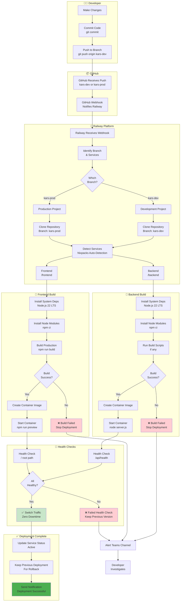

# Railway Auto-Deploy - KARS

Automatic deployment triggered by git push to kars-prod or kars-dev branches.



## Railway Auto-Deploy Process

### Trigger Events

**Automatic Deployment Triggered By:**
- Push to `kars-dev` branch → Deploys to kars-backend-dev, kars-frontend-dev
- Push to `kars-prod` branch → Deploys to kars-backend-prod, kars-frontend-prod
- Manual "Redeploy" in Railway Dashboard

**Not Triggered By:**
- Pushes to feature branches (feature/*)
- Pushes to hotfix branches (hotfix/*)
- Pull request creation (only after merge)

---

## Build Process Details

### Backend Build (Node.js)

**Detection:**
```
Railway detects: backend/package.json
Builder: Nixpacks
Runtime: Node.js 22 LTS
```

**Build Steps:**
1. **Install Dependencies:**
   ```bash
   cd backend
   npm ci --only=production
   ```

2. **Run Build (if configured):**
   ```bash
   # Only if build script exists in package.json
   npm run build
   ```

3. **Start Application:**
   ```bash
   node server.js
   ```

**Environment Variables:**
- Automatically injected by Railway
- DATABASE_URL from linked PostgreSQL service
- PORT assigned by Railway
- All custom variables from service configuration

### Frontend Build (Vite)

**Detection:**
```
Railway detects: frontend/package.json
Builder: Nixpacks
Runtime: Node.js 22 LTS
```

**Build Steps:**
1. **Install Dependencies:**
   ```bash
   cd frontend
   npm ci
   ```

2. **Build Production:**
   ```bash
   npm run build
   # Creates dist/ directory
   ```

3. **Start Preview Server:**
   ```bash
   npm run preview -- --host 0.0.0.0 --port $PORT
   ```

---

## Health Check Configuration

### Backend Health Check

**Endpoint:** `/api/health`

**Configuration:**
```yaml
path: /api/health
interval: 30s
timeout: 5s
retries: 3
```

**Expected Response:**
```json
{
  "status": "ok",
  "timestamp": "2025-01-05T10:00:00.000Z"
}
```

**Failure Conditions:**
- HTTP status != 200
- Response time > 5s
- Connection refused
- 3 consecutive failures

### Frontend Health Check

**Endpoint:** `/` (root)

**Configuration:**
```yaml
interval: 30s
timeout: 5s
retries: 3
```

**Expected Response:**
- HTTP 200 OK
- HTML content served

---

## Deployment Timeline

### Typical Deployment Timeline

| Phase | Duration | Details |
|-------|----------|---------|
| **Webhook Trigger** | < 1 second | GitHub → Railway |
| **Repository Clone** | 10-20 seconds | Clone branch |
| **Backend Build** | 60-90 seconds | npm ci + build |
| **Frontend Build** | 45-60 seconds | npm ci + vite build |
| **Container Creation** | 10-15 seconds | Package application |
| **Service Start** | 5-10 seconds | Start containers |
| **Health Checks** | 10-15 seconds | Verify health |
| **Traffic Switch** | < 1 second | Zero-downtime |
| **Total** | **3-5 minutes** | Complete deployment |

---

## Zero-Downtime Deployment

### How It Works

1. **Old Version Keeps Running:**
   - Current deployment continues serving traffic
   - No interruption to users

2. **New Version Built:**
   - New containers built in parallel
   - Not yet receiving traffic

3. **Health Checks Pass:**
   - New version validates as healthy
   - Ready to receive traffic

4. **Traffic Switched:**
   - Railway switches all traffic to new version
   - Instant switchover (< 1 second)
   - No dropped connections

5. **Old Version Kept:**
   - Previous deployment kept for rollback
   - Can instantly revert if needed

---

## Monitoring Deployment

### Via Railway Dashboard

1. Navigate to Railway project
2. Click on service (e.g., kars-backend-prod)
3. View "Deployments" tab
4. See real-time build logs
5. Monitor deployment status

### Via Railway CLI

```bash
# Link to service
railway link kars-backend-prod

# Watch logs
railway logs --follow

# Check status
railway status

# View specific deployment
railway logs --deployment latest
```

### Via GitHub

1. Repository → Actions tab
2. See deployment status (if using GitHub Actions)
3. Railway deployment status shown in commits

---

## Rollback Options

### Option 1: Railway One-Click Rollback (Fastest)

```bash
railway link kars-backend-prod
railway rollback
```

**Time to Rollback:** < 1 minute

### Option 2: Redeploy Previous Version

1. Railway Dashboard → Deployments
2. Find last good deployment
3. Click "..." → "Redeploy"

**Time to Rollback:** ~3-5 minutes (full redeploy)

### Option 3: Git Revert

```bash
git revert HEAD
git push origin kars-prod
```

**Time to Rollback:** ~5 minutes (new deployment)

---

## Troubleshooting Failed Deployments

### Build Failures

**Symptoms:**
- "Build failed" status in Railway
- npm install errors in logs
- Missing dependencies

**Solutions:**
```bash
# Test build locally
cd backend && npm ci && npm start
cd frontend && npm ci && npm run build

# Check package-lock.json committed
git status

# Verify Node version (must be 22 LTS)
node --version
```

### Health Check Failures

**Symptoms:**
- "Health check failed" in Railway
- Service keeps restarting
- Previous version remains active

**Solutions:**
```bash
# Check if service starts locally
npm start

# Verify health endpoint
curl http://localhost:3001/api/health

# Check environment variables
railway variables

# View detailed logs
railway logs --tail=200 | grep -i "error"
```

### Port Binding Issues

**Symptoms:**
- "EADDRINUSE" error
- Service won't start
- Port conflict errors

**Solutions:**
```javascript
// backend/server.js - Must bind to 0.0.0.0 and use $PORT
const PORT = process.env.PORT || 3001;
app.listen(PORT, '0.0.0.0', () => {
  console.log(`Server on port ${PORT}`);
});
```

```javascript
// frontend/vite.config.js
export default defineConfig({
  preview: {
    host: '0.0.0.0',
    port: process.env.PORT || 3000,
  },
});
```

---

## Best Practices

### DO
- ✅ Test builds locally before pushing
- ✅ Run tests before deployment (CI)
- ✅ Monitor deployment logs
- ✅ Verify health after deployment
- ✅ Keep package-lock.json committed
- ✅ Use semantic versioning for tags

### DON'T
- ❌ Push broken code to kars-prod
- ❌ Skip testing on kars-dev first
- ❌ Deploy during peak hours (except Monday schedule)
- ❌ Ignore health check failures
- ❌ Delete deployment history
- ❌ Skip monitoring after deployment

---

**Last Updated:** January 2025  
**Related:** [Railway Setup Guide](../railway/SETUP-GUIDE.md), [Deployment Decision Tree](08-deployment-decision-tree.md)
