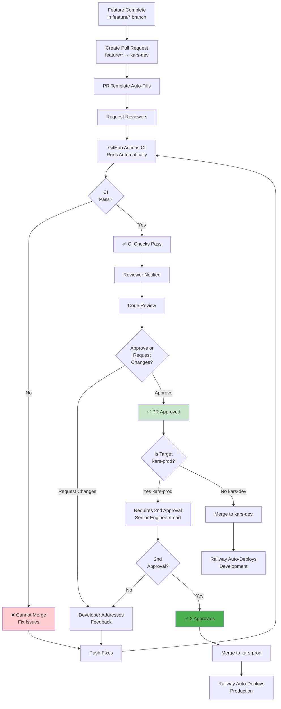

# Branch Protection & Approval - KARS

PR review and merge approval process for protected branches.



## Branch Protection Rules

### kars-dev (Development Branch)

**Protection Settings:**
- ✅ Require pull request before merging
- ✅ Require status checks to pass (GitHub Actions CI)
- ✅ Require 1 approval
- ❌ No force push allowed
- ❌ No deletions allowed

**Required Status Checks:**
- `ci-tests` - Backend and frontend tests must pass
- `build` - Build verification must succeed

**Who Can Approve:**
- Any team member
- Automated approvals not allowed

### kars-prod (Production Branch)

**Protection Settings:**
- ✅ Require pull request before merging
- ✅ Require status checks to pass
- ✅ Require 2 approvals
- ✅ Dismiss stale reviews on new commits
- ❌ No force push allowed (except admins)
- ❌ No deletions allowed

**Required Status Checks:**
- `ci-tests` - All tests must pass
- `build` - Production build must succeed
- `security-scan` - No critical vulnerabilities

**Who Can Approve:**
- Senior Engineers
- Team Leads
- DevOps Engineers

---

## PR Review Process

### 1. Create Pull Request

**PR Template:**
```markdown
## Description
Brief description of changes

## Type of Change
- [ ] Bug fix
- [ ] New feature
- [ ] Breaking change
- [ ] Documentation update

## Related Issue
Closes #ISSUE_NUMBER

## Testing
- [ ] Unit tests added/updated
- [ ] Integration tests pass
- [ ] Manually tested on kars-dev

## Checklist
- [ ] Code follows style guidelines
- [ ] Self-review completed
- [ ] Comments added for complex code
- [ ] Documentation updated
- [ ] No breaking changes (or documented)

## Screenshots (if applicable)
[Add screenshots for UI changes]
```

### 2. Automated Checks

**GitHub Actions CI:**
```yaml
# Runs automatically on PR
jobs:
  test-backend:
    - npm ci
    - npm test
  test-frontend:
    - npm ci
    - npm test
  build:
    - npm run build
```

**Must Pass:**
- All tests (backend + frontend)
- Linting
- Build succeeds
- No merge conflicts

### 3. Code Review

**Reviewer Checklist:**
- [ ] **Functionality:** Does the code do what it's supposed to?
- [ ] **Tests:** Are there adequate tests?
- [ ] **Security:** Any security concerns?
- [ ] **Performance:** Any performance issues?
- [ ] **Style:** Follows project conventions?
- [ ] **Documentation:** Is code documented?
- [ ] **Breaking Changes:** Any breaking changes documented?

**Review Timeframe:**
- Standard PRs: Within 24 hours
- Urgent PRs: Within 4 hours
- Hotfixes: Immediate (< 1 hour)

### 4. Approval

**kars-dev (1 Approval Required):**
- Any engineer can approve
- Self-approval not allowed
- Automated tools can't approve

**kars-prod (2 Approvals Required):**
- First approval: Any senior engineer
- Second approval: Team lead or different senior engineer
- Both must be from different people
- Cannot self-approve

---

## Common Scenarios

### Feature PR to kars-dev

```bash
# 1. Create PR
gh pr create --base kars-dev --head feature/my-feature \
  --title "Add asset export feature" \
  --body "Implements CSV export for assets. Closes #123"

# 2. Wait for CI
# GitHub Actions runs automatically

# 3. Request review
gh pr request-review @teammate

# 4. After approval, merge
gh pr merge --squash
```

### Release PR to kars-prod

```bash
# 1. Create release PR (Monday morning)
gh pr create --base kars-prod --head kars-dev \
  --title "Production Release - $(date +%Y-%m-%d)" \
  --body "Weekly release after Friday QA approval"

# 2. Request reviews from 2 senior engineers
gh pr request-review @senior-eng-1 @senior-eng-2

# 3. Wait for 2 approvals + CI pass

# 4. Merge (Monday 10:00 AM)
gh pr merge --merge
```

---

## Override Procedures

### Emergency Hotfix

For P0 incidents, protection can be temporarily bypassed:

**Requirements:**
1. Post in #kars-incidents justifying override
2. Get verbal approval from team lead
3. Document reason in PR
4. Create follow-up PR for proper review

**After Override:**
- Create post-mortem
- Review what was bypassed
- Ensure no security issues introduced

---

## Best Practices

### For PR Authors

**DO:**
- ✅ Keep PRs small and focused
- ✅ Write clear descriptions
- ✅ Add tests for new code
- ✅ Self-review before requesting review
- ✅ Respond to feedback promptly
- ✅ Resolve conversations after addressing

**DON'T:**
- ❌ Create huge PRs (>500 lines)
- ❌ Mix unrelated changes
- ❌ Skip tests
- ❌ Force push after approval
- ❌ Merge without passing CI
- ❌ Self-approve (use automation for that)

### For Reviewers

**DO:**
- ✅ Review within 24 hours
- ✅ Be constructive and specific
- ✅ Test code locally if complex
- ✅ Ask questions if unclear
- ✅ Approve only if confident

**DON'T:**
- ❌ Rubber-stamp approvals
- ❌ Nitpick trivial issues
- ❌ Block on style preferences
- ❌ Approve without understanding code
- ❌ Review your own PR

---

**Last Updated:** January 2025  
**Related:** [Feature Development Workflow](02-feature-development-workflow.md), [Complete CI/CD Flow](01-complete-cicd-flow.md)
