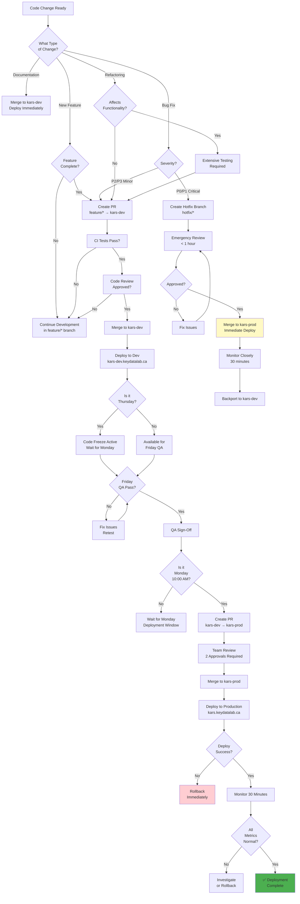
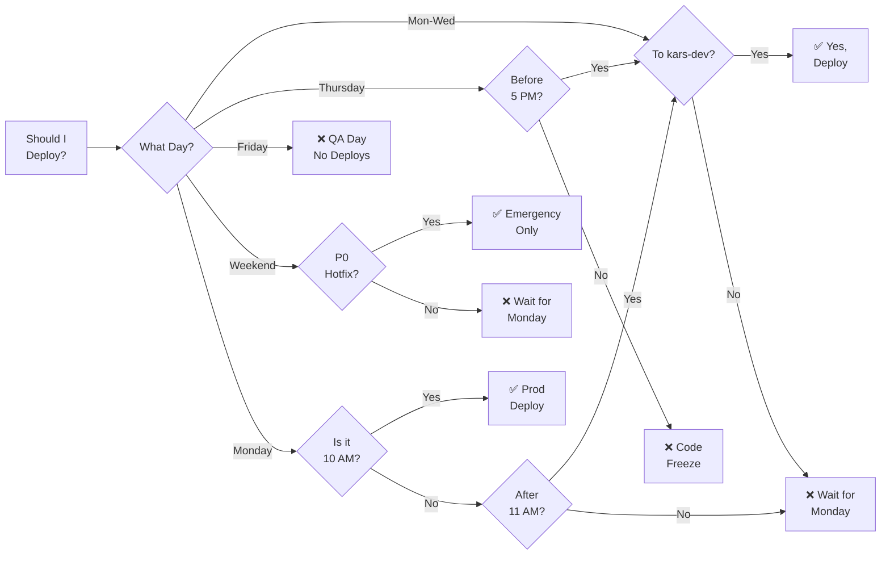
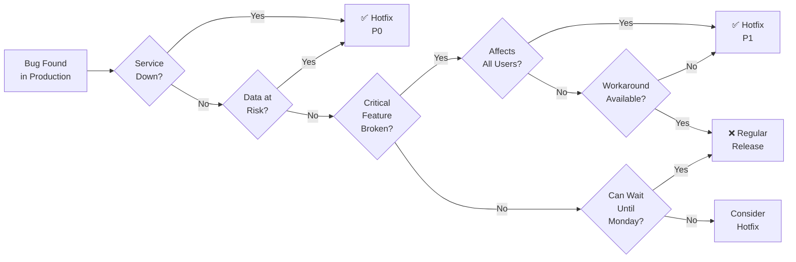

# Deployment Decision Tree - KARS

Logic for making deployment decisions.

## Decision Factors

### 1. Change Type

| Type | Path | Timeline |
|------|------|----------|
| **New Feature** | feature/* → kars-dev → Friday QA → Monday prod | 1-3 weeks |
| **Minor Bug** | feature/* → kars-dev → Friday QA → Monday prod | 1-2 weeks |
| **Critical Bug** | hotfix/* → kars-prod (immediate) | 2-4 hours |
| **Documentation** | kars-dev (immediate) | Same day |
| **Refactoring** | feature/* → kars-dev → Extended QA | 2-4 weeks |

### 2. Severity Level

**P0 - Critical (Hotfix):**
- ✅ Deploy immediately to kars-prod
- ✅ Skip weekly cycle
- ✅ Emergency approval process
- ⚠️ Risk: Higher chance of issues

**P1 - High:**
- ❓ Evaluate: Can it wait until Monday?
- If yes: Normal cycle
- If no: Hotfix process

**P2/P3 - Medium/Low:**
- ✅ Always use normal cycle
- ✅ Include in Monday release

### 3. Testing Requirements

**New Features:**
- Unit tests required
- Integration tests required
- QA testing on Friday
- Browser compatibility

**Bug Fixes:**
- Test must reproduce bug
- Test must verify fix
- Regression testing

**Hotfixes:**
- Minimal testing (time-critical)
- Focus on fix verification
- Extended monitoring after deploy

### 4. Timing

**Monday - Wednesday:**
- ✅ Normal development
- ✅ Merge to kars-dev anytime
- ✅ Features available for Friday QA

**Thursday:**
- ⚠️ Code freeze at 5:00 PM EST
- ❌ No new features after freeze
- ✅ Critical bugs only

**Friday:**
- ❌ No merges to kars-dev (frozen)
- ✅ QA testing all day
- ✅ Bug fixes if needed

**Weekend:**
- ❌ No planned deployments
- ✅ Hotfixes for P0 only

**Monday:**
- ✅ Production deployment (10:00 AM)
- ✅ Code freeze lifts (11:00 AM)
- ✅ Development resumes

---

## Decision Flowcharts

### Should I Deploy Today?

### Should This Be a Hotfix?

---

## Common Scenarios

### Scenario 1: New Feature on Wednesday
**Decision:** Merge to kars-dev, include in Friday QA

**Rationale:**
- Enough time for QA testing
- Follows normal cycle
- Low risk

### Scenario 2: Bug Found on Thursday 6 PM
**Decision:** Create ticket, fix Monday

**Rationale:**
- Code freeze active
- Not critical (P2/P3)
- Can wait for normal cycle

### Scenario 3: Production Down on Saturday
**Decision:** Immediate hotfix to kars-prod

**Rationale:**
- P0 severity
- Service unusable
- Emergency override justified

### Scenario 4: Feature Ready on Friday
**Decision:** Merge to kars-dev, deploy next Monday

**Rationale:**
- Missed Friday QA window
- Will be tested next Friday
- Follows standard process

---

**Last Updated:** January 2025  
**Related:** [Hotfix Workflow](03-hotfix-workflow.md), [Weekly Release Cycle](04-weekly-release-cycle.md)
