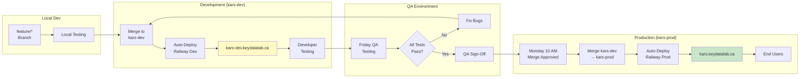

# Environment Promotion - KARS

Code promotion from development to production.

## Promotion Stages

### Stage 1: Local Development
- **Branch:** feature/*
- **Testing:** Unit tests, local validation
- **Users:** Individual developer
- **Duration:** 2-5 days

### Stage 2: Development Environment
- **Branch:** kars-dev
- **URL:** https://kars-dev.keydatalab.ca
- **Testing:** Integration, developer validation
- **Users:** All developers, initial QA
- **Duration:** 1-7 days (until Friday QA)

### Stage 3: QA Validation
- **Environment:** kars-dev (same)
- **Testing:** Full regression, performance, security
- **Users:** QA team
- **Duration:** Friday (full day)

### Stage 4: Production
- **Branch:** kars-prod
- **URL:** https://kars.keydatalab.ca
- **Testing:** Smoke tests, monitoring
- **Users:** All end users
- **Duration:** Ongoing

---

## Promotion Criteria

### Development → QA
**Automatic** (continuous)
- Code merged to kars-dev
- CI tests pass
- Auto-deployed by Railway

### QA → Production
**Manual** (weekly)
- All QA tests pass
- QA team sign-off
- No critical bugs
- Code freeze respected
- Monday deployment window

---

**Last Updated:** January 2025
