# Complete Release Workflow - KARS

Full weekly release process with all stakeholders.

```mermaid
flowchart TB
    subgraph Week["Monday (Start of Week)"]
        A[Previous Release<br/>Complete] --> B[Sprint Planning]
        B --> C[Assign Features<br/>to Developers]
    end
    
    subgraph Development["Tue-Thu Development"]
        C --> D[Developers Build<br/>Features]
        D --> E[Create PRs<br/>feature/* → kars-dev]
        E --> F[Code Review]
        F --> G[Merge to kars-dev]
        G --> H[Auto-Deploy to Dev]
    end
    
    subgraph ThursdayFreeze["Thursday 5 PM EST"]
        H --> I[Product Manager<br/>Reviews Features]
        I --> J[Announce Code Freeze<br/>#kars-releases]
        J --> K[Prepare Release Notes]
    end
    
    subgraph FridayQA["Friday - QA Day"]
        K --> L[QA Team Tests<br/>kars-dev.keydatalab.ca]
        L --> M[DevOps Monitors<br/>Dev Environment]
        M --> N{All Tests<br/>Pass?}
        N -->|No| O[Developers<br/>Fix Issues]
        O --> P[Retest Fixes]
        P --> N
        N -->|Yes| Q[QA Sign-Off<br/>3:00 PM EST]
        Q --> R[Product Manager<br/>Approves Release]
        R --> S[Notify Stakeholders<br/>#kars-releases]
    end
    
    subgraph Weekend["Weekend"]
        S --> T[No Activity<br/>Emergency Hotfixes Only]
    end
    
    subgraph MondayDeploy["Monday - Deployment"]
        T --> U[DevOps Pre-Flight<br/>9:45 AM EST]
        U --> V[Create PR<br/>kars-dev → kars-prod]
        V --> W[Team Lead Review]
        W --> X[Merge Approved<br/>10:00 AM EST]
        X --> Y[Auto-Deploy<br/>to Production]
        Y --> Z[DevOps Monitors<br/>Deployment]
        Z --> AA{Deploy<br/>Success?}
        AA -->|No| AB[DevOps Rollback]
        AB --> AC[Alert #kars-incidents]
        AA -->|Yes| AD[Smoke Tests]
        AD --> AE[Product Manager<br/>Verifies Release]
        AE --> AF[Post Success<br/>#kars-releases]
        AF --> AG[Lift Code Freeze<br/>11:00 AM EST]
        AG --> A
    end
    
    style Q fill:#c8e6c9
    style AF fill:#4caf50
    style AB fill:#ffcdd2
```

## Stakeholder Responsibilities

### Developers
- Build features (Tue-Thu)
- Fix QA issues (Friday)
- On standby (Monday deployment)

### QA Team
- Test features (Friday all day)
- Sign off by 3:00 PM EST
- Verify production (Monday)

### DevOps
- Monitor environments
- Execute deployment (Monday 10 AM)
- Handle rollback if needed

### Product Manager
- Review features (Thursday)
- Approve release (Friday)
- Verify production (Monday)
- Communicate to stakeholders

---

**Last Updated:** January 2025
