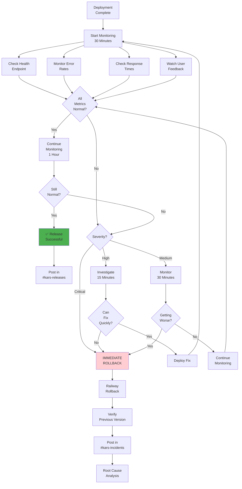

# Monitoring & Rollback - KARS

Post-deployment monitoring and rollback procedures.



## Monitoring Checklist

### Immediate (0-15 minutes)
- [ ] Health endpoint responds
- [ ] No 5xx errors in logs
- [ ] Response times < 500ms
- [ ] Database connected

### Short-term (15-30 minutes)
- [ ] Error rate < 1%
- [ ] No user complaints
- [ ] Memory usage stable
- [ ] CPU usage normal

### Long-term (30-60 minutes)
- [ ] All features working
- [ ] Performance acceptable
- [ ] No degradation over time
- [ ] External integrations OK

---

## Rollback Procedures

### Option 1: Railway One-Click (< 1 minute)
```bash
railway link kars-backend-prod
railway rollback
```

### Option 2: Git Revert (~5 minutes)
```bash
git revert HEAD
git push origin kars-prod
```

### Option 3: Redeploy Previous (~5 minutes)
- Railway Dashboard → Deployments
- Find last good deployment
- Click "Redeploy"

---

## Metrics to Monitor

| Metric | Normal | Warning | Critical |
|--------|--------|---------|----------|
| **Response Time** | < 500ms | 500ms-1s | > 1s |
| **Error Rate** | < 0.1% | 0.1%-1% | > 1% |
| **CPU Usage** | < 50% | 50%-80% | > 80% |
| **Memory Usage** | < 70% | 70%-90% | > 90% |
| **Health Check** | 200 OK | Intermittent | Failed |

---

**Last Updated:** January 2025  
**Related:** [Incident Response](../INCIDENT-RESPONSE.md), [Runbook](../RUNBOOK.md)
