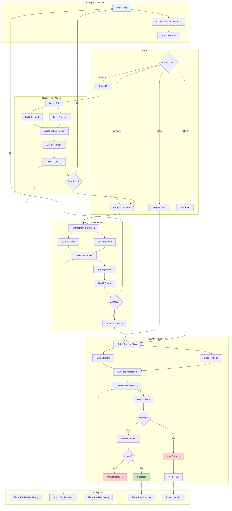

# Complete CI/CD Flow (All Environments)

## Description
This diagram shows the complete continuous integration and continuous deployment flow for ACS, from developer workstation through GitHub to Railway environments (PR Preview, Dev, Prod) with notifications.

## When to Reference
- Understanding the full deployment pipeline
- Onboarding new developers
- Troubleshooting deployment issues
- Planning infrastructure changes

## Flow Overview
The diagram illustrates how code moves from a developer's local machine through multiple Railway environments with automated testing, deployment, and monitoring at each stage.

## Key Points

### Environment Characteristics
- **PR Preview**: Ephemeral, short-lived, automatically created per PR
- **Development**: Persistent environment for integration testing
- **Production**: Live environment with zero-downtime deployment

### Build Times
- Backend: ~2 minutes
- Frontend: ~2 minutes
- Total deployment: ~5 minutes

### Automatic Rollback Triggers
- Health check failures
- Critical error rate increase
- Service unresponsive

### Manual Intervention Points
1. Code review approval (PR → develop)
2. QA approval (develop → release PR)
3. Release approval (release PR → main)
4. Manual rollback decision (if monitoring detects issues)

## Related Diagrams
- [Feature Development Workflow](02-feature-development-workflow.md) - Detailed developer perspective
- [Railway Auto-Deploy Process](06-railway-auto-deploy.md) - Technical deployment details
- [Monitoring & Rollback](11-monitoring-rollback.md) - Post-deployment procedures
