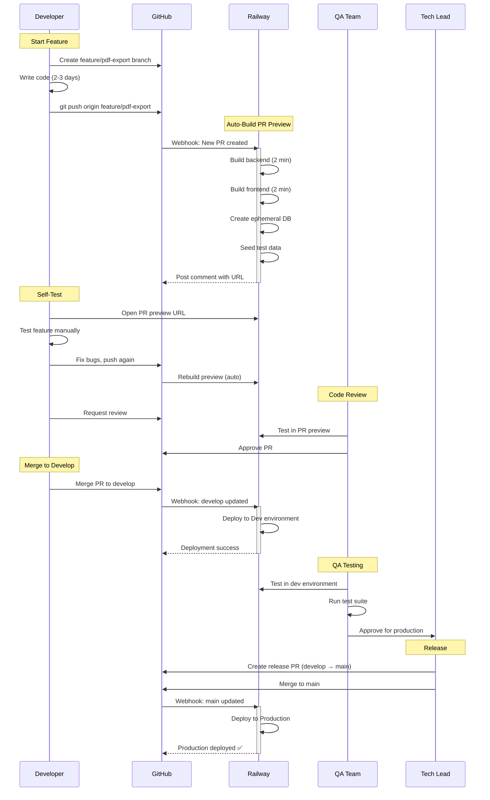

# Feature Development Workflow (Swimlanes)

## Description
This sequence diagram shows the complete feature development lifecycle from developer through QA to production, including all interactions with Railway environments.

## When to Reference
- Starting work on a new feature
- Understanding the code review process
- Training new team members on the development workflow
- Estimating feature development timelines

## Timeline Overview
Typical feature lifecycle: 3-5 days development + 1 day QA + weekly release cycle

## Key Stages

### 1. Feature Development (2-3 days)
- Developer creates feature branch from `develop`
- Implements feature with local testing
- Commits and pushes code to GitHub

### 2. PR Preview (automatic, ~4 minutes)
- Railway detects new PR
- Builds both services in parallel
- Creates ephemeral database
- Seeds with test data
- Posts preview URL to PR comments

### 3. Self-Testing & Code Review (1-2 days)
- Developer tests feature in PR preview
- Makes adjustments as needed
- Railway automatically rebuilds on new commits
- Requests code review from QA

### 4. Integration Testing (Friday)
- QA tests in PR preview environment
- Approves PR after validation
- Developer merges to `develop`
- Railway auto-deploys to Dev environment

### 5. QA Validation (Friday)
- QA performs comprehensive testing in Dev
- Runs automated test suite
- Approves feature for production release

### 6. Production Release (Monday)
- Tech Lead creates release PR (`develop` → `main`)
- Team reviews release notes
- Merge triggers Railway production deployment
- Monitor for 30 minutes post-deployment

## Best Practices

### Developer Responsibilities
- Test locally before pushing
- Write clear commit messages
- Update documentation as needed
- Test feature thoroughly in PR preview
- Respond to code review feedback promptly

### QA Responsibilities
- Test both happy path and edge cases
- Verify mobile responsiveness
- Check accessibility
- Validate against acceptance criteria
- Document any issues found

### Tech Lead Responsibilities
- Review high-impact changes personally
- Coordinate release timing
- Monitor production deployments
- Make rollback decisions if needed

## Typical Timeline

| Day | Activity | Duration |
|-----|----------|----------|
| Mon-Wed | Feature development | 2-3 days |
| Thu | Code review & adjustments | 1 day |
| Fri AM | Merge to develop, QA testing | 4 hours |
| Fri PM | Create release PR | 1 hour |
| Mon AM | Deploy to production | 30 min |
| Mon | Monitor production | 2 hours |

## Related Diagrams
- [Complete CI/CD Flow](01-complete-cicd-flow.md) - Overall pipeline
- [Weekly Release Cycle](04-weekly-release-cycle.md) - Release scheduling
- [Branch Protection & Approval](07-branch-protection-approval.md) - Approval requirements
