# Hotfix Workflow (Emergency)

## Description
Emergency hotfix process for critical production bugs with fast-track deployment. This workflow bypasses the normal weekly release cycle for urgent fixes.

## When to Reference
- Critical bug discovered in production
- Service degradation affecting users
- Security vulnerability requiring immediate patch
- Data integrity issues

## Severity Guidelines
Use hotfix workflow for:
- **Critical**: Service down, data loss, security breach
- **High**: Major feature broken, affecting 50%+ of users
- **Not for**: Minor bugs, UI issues, non-urgent improvements

```mermaid
sequenceDiagram
    participant User as 200 Users
    participant Mon as Monitoring
    participant Dev as Developer
    participant Git as GitHub
    participant Rail as Railway
    participant PO as Tech Lead

    Note over User: 🔥 Critical Bug in Production
    User->>Mon: Errors reported
    Mon->>Dev: Alert: PDF export crashes
    
    Note over Dev: Emergency Fix
    Dev->>Git: git checkout main
    Dev->>Git: git checkout -b hotfix/pdf-crash
    Dev->>Dev: Fix bug (15 mins)
    Dev->>Git: git push origin hotfix/pdf-crash
    
    Note over Rail: Fast-Track Testing
    Git->>Rail: Create PR preview
    activate Rail
    Rail->>Rail: Build & deploy preview (2 min)
    deactivate Rail
    Dev->>Rail: Test fix in preview
    
    Note over Dev: Emergency Merge
    Dev->>Git: Create PR (hotfix → main)
    PO->>Git: Emergency approval (no wait)
    PO->>Git: Merge to main immediately
    
    Note over Rail: Deploy to Production
    Git->>Rail: Webhook: main updated
    activate Rail
    Rail->>Rail: Build (2 min)
    Rail->>Rail: Deploy to production
    Rail->>Rail: Health check
    Rail-->>Mon: Deployment success
    deactivate Rail
    
    Note over User: Bug Fixed!
    Mon->>User: Service restored (20 min total)
    
    Note over Dev: Backport to Develop
    Dev->>Git: git checkout develop
    Dev->>Git: git merge hotfix/pdf-crash
    Dev->>Git: git push origin develop
    Git->>Rail: Update dev environment
```



## Hotfix Process Steps

### 1. Identify & Alert (2-5 minutes)
- Users report critical issue
- Monitoring systems detect anomaly
- On-call developer receives alert
- Tech Lead confirms severity

### 2. Create Hotfix Branch (1 minute)
```bash
git checkout main
git pull origin main
git checkout -b hotfix/descriptive-name
```

### 3. Implement Fix (10-30 minutes)
- Make minimal changes to fix issue
- Focus on the specific problem only
- Avoid scope creep or "while we're here" improvements
- Write clear commit message explaining the fix

### 4. Test in PR Preview (5-10 minutes)
- Push branch to GitHub
- Railway automatically creates PR preview
- Test the specific issue is resolved
- Verify no new issues introduced

### 5. Emergency Approval (2-5 minutes)
- Create PR from `hotfix/*` to `main`
- Tag Tech Lead for immediate review
- Use PR title: `[HOTFIX] Brief description`
- Include impact assessment in PR description

### 6. Deploy to Production (5 minutes)
- Tech Lead approves and merges immediately
- Railway auto-deploys to production
- Monitor deployment health checks
- Verify fix resolves the issue

### 7. Backport to Develop (5 minutes)
**Critical**: Don't forget this step!
```bash
git checkout develop
git pull origin develop
git merge hotfix/descriptive-name
git push origin develop
```

## Timeline

| Step | Time | Total Elapsed |
|------|------|---------------|
| Alert & Triage | 2-5 min | 5 min |
| Create Branch & Fix | 10-30 min | 20 min |
| Test in Preview | 5-10 min | 25 min |
| Emergency Approval | 2-5 min | 27 min |
| Production Deploy | 5 min | 32 min |
| Backport to Develop | 5 min | 37 min |

**Target**: Issue resolved in under 30 minutes

## Decision Matrix

| Severity | Response Time | Approval | Testing |
|----------|---------------|----------|---------|
| **Critical** (service down) | Immediate | Tech Lead only | Preview + smoke test |
| **High** (major feature broken) | Within 1 hour | Tech Lead + 1 reviewer | Preview + affected areas |
| **Medium** (minor bug) | Use normal release | Standard process | Full QA cycle |

## Communication Protocol

### During Hotfix
1. Post in #dev-alerts Slack channel
2. Update status page if customer-facing
3. Notify Tech Lead immediately
4. Document timeline in incident log

### After Deployment
1. Verify fix with original reporter
2. Update incident log with resolution
3. Schedule post-mortem for next day
4. Document learnings in wiki

## Common Hotfix Scenarios

### Database Migration Issues
```bash
# Hotfix branch
git checkout -b hotfix/fix-migration

# Fix migration script
# Test in preview (uses ephemeral DB)
# Deploy to prod carefully
```

### API Breaking Change
- Coordinate with users if possible
- Consider backward compatibility
- Deploy during low-traffic window
- Monitor error rates closely

### Security Vulnerability
- Create hotfix branch immediately
- Do NOT discuss details publicly
- Fast-track through security review
- Deploy ASAP
- Coordinate disclosure timeline

## Anti-Patterns (Don't Do This)

❌ **Skip PR preview testing** - Always test before production
❌ **Make multiple unrelated changes** - Keep hotfixes focused
❌ **Forget to backport to develop** - Leads to regression in next release
❌ **Skip post-mortem** - Miss opportunity to prevent recurrence
❌ **Use hotfix for non-urgent issues** - Respect the process

## Rollback Plan

If hotfix makes things worse:
1. Identify issue within 5 minutes
2. Use Railway dashboard to rollback to previous deployment
3. Revert hotfix merge on main branch
4. Reassess and create new hotfix if needed

## Post-Hotfix Checklist

- [ ] Fix verified working in production
- [ ] Hotfix backported to develop branch
- [ ] Incident log updated with resolution
- [ ] Status page updated (if applicable)
- [ ] Post-mortem scheduled (within 24 hours)
- [ ] Monitoring thresholds reviewed
- [ ] Documentation updated if needed
- [ ] Team notified of resolution

## Related Diagrams
- [Complete CI/CD Flow](01-complete-cicd-flow.md) - Normal deployment flow
- [Monitoring & Rollback](11-monitoring-rollback.md) - When to rollback
- [Deployment Decision Tree](08-deployment-decision-tree.md) - Choosing deployment path
