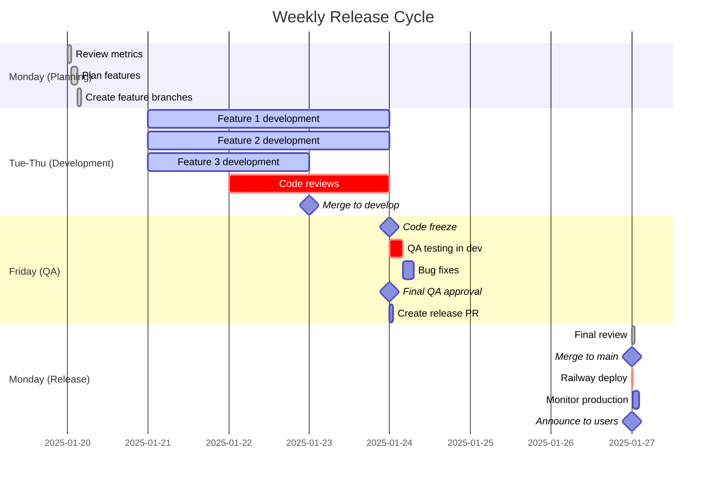

# Weekly Release Cycle

## Description
Gantt chart showing the weekly release schedule from Monday planning through Friday QA to Monday production release. This represents the standard cadence for ACS feature releases.

## When to Reference
- Planning sprint work
- Understanding release timeline
- Coordinating feature delivery
- Setting stakeholder expectations

## Release Philosophy
- **Predictable**: Weekly releases every Monday
- **Tested**: Full QA cycle before production
- **Controlled**: Code freeze on Friday for weekend stability
- **Sustainable**: Developers can plan work around release schedule

## Detailed Schedule

### Monday (Release & Planning Day)

**Morning (9:00 AM - 11:00 AM): Production Release**
- 9:00: Final review of release PR
- 9:30: Merge to main
- 9:35: Railway begins deployment
- 9:50: Deployment complete
- 10:00-11:00: Active monitoring
- 11:00: Announce release to users

**Afternoon (1:00 PM - 3:00 PM): Planning**
- Review previous week's metrics
- Review user feedback and issues
- Plan features for upcoming week
- Break down features into tasks
- Create feature branches

### Tuesday-Thursday (Development Window)

**All Day: Feature Development**
- Developers work on assigned features
- Create PRs when features are ready
- Railway auto-creates PR previews
- Self-test in PR preview environments

**Ongoing: Code Reviews**
- Review PRs as they come in
- Test in PR preview before approving
- Provide constructive feedback
- Approve when ready

**Thursday EOD: Merge Deadline**
- All features for this release merged to `develop` by 5 PM
- Railway auto-deploys to Dev environment
- No new features after this point

### Friday (QA & Release Prep)

**Morning (9:00 AM - 1:00 PM): Code Freeze & QA**
- 9:00: Code freeze announced
- 9:00-1:00: QA team tests in Dev environment
- Run automated test suite
- Manual testing of new features
- Regression testing

**Afternoon (1:00 PM - 5:00 PM): Bug Fixes**
- Prioritize and fix critical bugs found
- Re-test fixes in Dev environment
- Minor issues can be addressed next week

**End of Day (5:00 PM): Release Preparation**
- QA gives final approval
- Create release PR (`develop` → `main`)
- Update version number and changelog
- Document any known issues

### Weekend (Hands-Off)

- No deployments scheduled
- No code changes to main or develop
- On-call team available for emergencies
- Hotfix process available if needed

## Key Milestones

| Milestone | Day | Time | Description |
|-----------|-----|------|-------------|
| 🎯 Feature Branches Created | Monday | 3:00 PM | Development can begin |
| 🔀 Code Reviews Begin | Tuesday | 9:00 AM | PRs ready for review |
| 🏁 Merge Deadline | Thursday | 5:00 PM | Last merge to develop |
| ❄️ Code Freeze | Friday | 9:00 AM | No new features |
| ✅ QA Approval | Friday | 5:00 PM | Ready for release |
| 🚀 Production Deploy | Monday | 9:35 AM | Release goes live |
| 📢 Release Announcement | Monday | 11:00 AM | Users notified |

## Roles & Responsibilities

### Developers
- Create feature branches Monday afternoon
- Develop features Tuesday-Thursday
- Complete PRs by Thursday 5 PM
- Fix critical bugs Friday if needed

### QA Team
- Review PRs in preview environments
- Comprehensive testing Friday morning
- Document bugs and work with devs
- Give final release approval Friday EOD

### Tech Lead
- Lead planning session Monday
- Review and approve PRs
- Make merge decisions
- Create release PR Friday
- Deploy to production Monday
- Monitor deployment

### Product Owner
- Prioritize features for the week
- Provide acceptance criteria
- Available for questions during development
- Review release notes

## Capacity Planning

### Expected Throughput
- **Small features**: 2-3 per developer per week
- **Medium features**: 1 per developer per week
- **Large features**: Plan across multiple weeks

### Buffer Time
- Reserve 20% of week for:
  - Code reviews
  - Bug fixes
  - Technical debt
  - Helping teammates

## Exception Handling

### What if QA finds critical bugs Friday?
1. Fix immediately if simple (< 1 hour)
2. If complex, remove feature from release
3. Feature continues development next week

### What if deployment fails Monday?
1. Railway auto-rollback if health check fails
2. Tech Lead assesses issue
3. Fix and redeploy, or postpone release
4. Communicate with stakeholders

### What if emergency fix needed mid-week?
1. Use hotfix workflow
2. Bypass normal release cycle
3. Deploy directly to main
4. Backport to develop
5. Continue normal release cycle

## Metrics & Success Criteria

### Release Velocity
- Target: 1 release per week
- Actual: Track in release log
- Goal: Maintain consistency

### Deployment Success Rate
- Target: 95% successful deployments
- Monitor: Railway deployment history
- Review: Weekly in planning meeting

### Time to Production
- Target: 7 days (feature branch to production)
- Actual: Track per feature
- Review: Monthly retrospective

## Communication

### Daily Standups
- Not required, but recommended
- Async updates in Slack
- Blockers escalated immediately

### Weekly Sync
- Monday planning: 2 hours
- Friday release review: 30 minutes

### Release Notes
- Drafted throughout the week
- Finalized Friday EOD
- Published Monday after deployment

## Related Diagrams
- [Feature Development Workflow](02-feature-development-workflow.md) - Developer perspective
- [Complete Release Workflow](10-complete-release-workflow.md) - Detailed sequence
- [Environment Promotion Flow](09-environment-promotion.md) - Code progression
