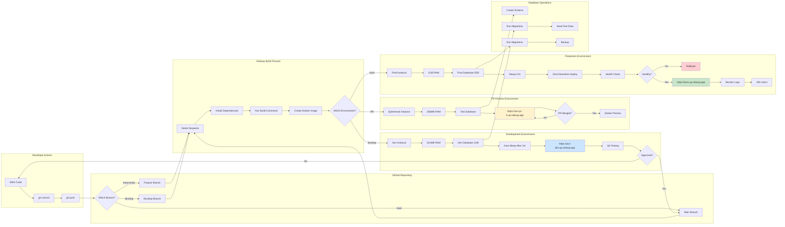

# Multi-Environment Deployment (Detailed Swimlane)

## Description
Shows how code flows through different Railway environments with resource allocation details. This diagram illustrates the infrastructure setup and deployment architecture.

## When to Reference
- Understanding Railway environment configuration
- Troubleshooting deployment issues
- Planning resource scaling
- Onboarding infrastructure engineers

## Architecture Overview
ACS uses three distinct Railway environments, each with different resource allocations and purposes.



## Environment Details

### PR Preview Environment

**Purpose**: Temporary environment for testing pull requests

**Configuration**:
- **RAM**: 256MB per service
- **Database**: SQLite ephemeral (deleted with PR)
- **URL**: `https://acs-pr-{number}.up.railway.app`
- **Lifecycle**: Created on PR open, deleted on merge/close
- **Auto-Sleep**: After 30 minutes of inactivity

**Use Cases**:
- Feature testing before merge
- Code review validation
- Stakeholder demos
- Bug reproduction

**Limitations**:
- Limited resources (can be slow)
- Data not persisted
- Not suitable for load testing
- Deleted when PR closes

### Development Environment

**Purpose**: Integration testing and QA validation

**Configuration**:
- **RAM**: 512MB per service
- **Database**: PostgreSQL 1GB persistent
- **URL**: `https://acs-dev.up.railway.app`
- **Lifecycle**: Always available
- **Auto-Sleep**: After 1 hour of inactivity (optional)

**Use Cases**:
- Integration testing
- QA comprehensive testing
- Demo environment for stakeholders
- Training and documentation

**Data Management**:
- Persistent database with test data
- Can be reset if needed
- Migrations run automatically
- Backup not critical (test data)

**Access**:
- Available to all team members
- Not exposed to end users
- Can be protected with basic auth

### Production Environment

**Purpose**: Live application for end users

**Configuration**:
- **RAM**: 1GB per service (scalable)
- **Database**: PostgreSQL 5GB with backups
- **URL**: `https://kars.up.railway.app`
- **Lifecycle**: Always on, never sleeps
- **High Availability**: Zero-downtime deployments

**Use Cases**:
- Live application for 200 users
- Production workloads
- Real customer data
- Performance monitoring

**Data Management**:
- Automatic daily backups
- Point-in-time recovery
- Migration rollback capability
- Strict access controls

**Monitoring**:
- Health checks every 30 seconds
- Error tracking with alerts
- Performance metrics
- Uptime monitoring

## Resource Scaling Triggers

### When to Scale PR Preview
- Not recommended (short-lived)
- If needed, increase RAM to 512MB

### When to Scale Development
**Indicators**:
- Slow response times during QA
- Memory warnings in logs
- Timeout errors during testing

**Action**: Increase to 1GB RAM

### When to Scale Production
**Indicators**:
- 80% memory utilization
- Response time > 500ms
- CPU > 80% sustained
- User count > 150

**Options**:
- Vertical: Increase to 2GB RAM
- Horizontal: Add service instances
- Database: Increase to 10GB storage

## Database Migration Strategy

### PR Preview
```bash
# Migrations run automatically on deploy
# Schema created fresh for each PR
# No data persistence needed
```

### Development
```bash
# Migrations run automatically on deploy
# Test data seeded after migrations
# Can reset database if needed:
railway env -e development exec "npm run db:reset"
```

### Production
```bash
# Migrations run automatically on deploy
# Backup taken before migration
# Rollback available if migration fails
# Monitor migration logs carefully
```

## Build Process Details

### 1. Detect & Install (2-3 minutes)
- Railway detects Node.js via `package.json`
- Uses Nixpacks build system
- Installs dependencies with `npm ci`
- Caches node_modules for faster builds

### 2. Build Frontend (1-2 minutes)
```bash
npm run build
# Creates optimized production bundle
# Outputs to /dist directory
```

### 3. Build Backend (1 minute)
```bash
# No build step needed (Node.js)
# Copies source files
# Sets up environment variables
```

### 4. Deploy (1-2 minutes)
- Creates new service instance
- Runs health checks
- Routes traffic when healthy
- Old instance kept as rollback point

## Health Check Configuration

### Backend Health Check
```
Endpoint: /api/health
Interval: 30 seconds
Timeout: 5 seconds
Retries: 3
```

**Success Criteria**:
- HTTP 200 status
- Response < 1 second
- Database connection active

### Frontend Health Check
```
Endpoint: /
Interval: 30 seconds
Timeout: 5 seconds
Retries: 3
```

**Success Criteria**:
- HTTP 200 status
- HTML content returned
- Static assets accessible

## Network Configuration

### Services
- **Backend**: Port 3001 (internal)
- **Frontend**: Port 80 (public)

### Communication
- Frontend → Backend: Via Railway internal networking
- External → Frontend: Via Railway public URL
- Backend → Database: Via Railway internal connection string

### Security
- HTTPS enforced on all public URLs
- Internal service-to-service communication encrypted
- Database connections use SSL/TLS
- Environment variables encrypted at rest

## Deployment Patterns

### Blue-Green Deployment (Production Only)
1. New version deployed alongside current
2. Health checks on new version
3. Traffic switched to new version
4. Old version kept for quick rollback
5. Old version removed after monitoring period

### Rolling Update (Not Used)
- Not applicable (single instance per environment)
- Would be used if scaling horizontally

### Canary Deployment (Not Implemented)
- Could route 10% traffic to new version
- Monitor metrics before full rollout
- Future enhancement possibility

## Cost Optimization

### PR Previews
- Auto-delete after 7 days if not closed
- Sleep after 30 minutes inactivity
- Minimal resource allocation

### Development
- Consider auto-sleep after 1 hour
- Use smaller database size
- Share environment across team

### Production
- Right-size resources for actual load
- Monitor usage patterns
- Scale only when needed
- Use reserved capacity if available

## Monitoring & Observability

### Logs
- Centralized in Railway dashboard
- Retained for 7 days
- Searchable and filterable
- Export capability

### Metrics
- CPU, memory, network usage
- Request count and latency
- Error rates
- Custom application metrics

### Alerts
- High memory usage (>85%)
- High error rate (>1%)
- Deployment failures
- Health check failures

## Related Diagrams
- [Complete CI/CD Flow](01-complete-cicd-flow.md) - Deployment pipeline
- [Railway Auto-Deploy Process](06-railway-auto-deploy.md) - Technical details
- [Environment Promotion Flow](09-environment-promotion.md) - Code progression
