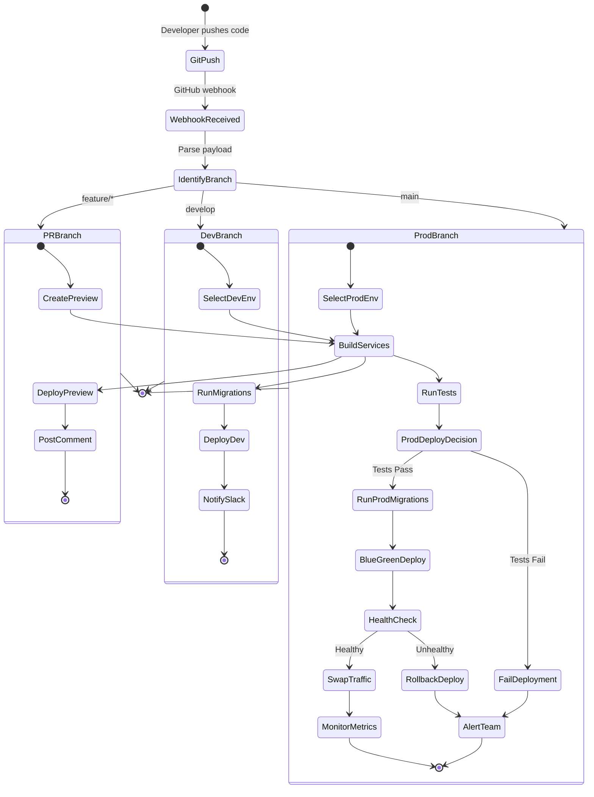

# Railway Auto-Deploy Process (Technical)

## Description
State diagram showing Railway's internal deployment decision logic and build process. This provides a technical view of how Railway processes different branch types and makes deployment decisions.

## When to Reference
- Debugging deployment issues
- Understanding Railway behavior
- Configuring new environments
- Troubleshooting webhook failures

## Technical Overview
Railway uses GitHub webhooks to receive push events and automatically triggers builds and deployments based on branch configuration.



## State Transitions

### Initial Flow

**1. GitPush → WebhookReceived**
- Developer pushes code to GitHub
- GitHub sends webhook POST to Railway
- Payload includes: commit SHA, branch name, changed files

**2. WebhookReceived → IdentifyBranch**
- Railway parses webhook payload
- Extracts branch name
- Matches against environment configuration

**3. IdentifyBranch → Environment**
- Branches matching `feature/*` → PR Preview
- Branch matching `develop` → Development
- Branch matching `main` → Production

### PR Preview Branch Flow

**State: PRBranch**

**CreatePreview**
- Check if PR preview already exists
- If not, create new Railway service
- Generate unique subdomain: `acs-pr-{number}.railway.app`
- Allocate minimal resources (256MB RAM)

**BuildServices**
- Clone repository at PR branch
- Detect build system (Nixpacks)
- Install dependencies (`npm ci`)
- Build frontend (`npm run build`)
- Build backend (copy source)

**DeployPreview**
- Create ephemeral database
- Run database migrations
- Seed test data (optional)
- Start services
- Wait for healthy status

**PostComment**
- Generate preview URL
- Post comment to GitHub PR
- Include deployment status
- Link to logs and monitoring

### Development Branch Flow

**State: DevBranch**

**SelectDevEnv**
- Identify Development environment
- Check current deployment status
- Prepare for blue-green deploy

**BuildServices**
- Clone repository at develop branch
- Detect build system (Nixpacks)
- Install dependencies (`npm ci`)
- Build frontend (`npm run build`)
- Build backend (copy source)

**RunMigrations**
- Connect to Development database
- Run pending migrations
- Verify migration success
- Update schema version

**DeployDev**
- Deploy new backend instance
- Deploy new frontend instance
- Run health checks
- Switch traffic when healthy

**NotifySlack**
- Post deployment success to Slack
- Include version info
- Link to environment URL
- Notify QA team

### Production Branch Flow

**State: ProdBranch**

**SelectProdEnv**
- Identify Production environment
- Check current deployment status
- Take pre-deployment snapshot

**BuildServices**
- Clone repository at main branch
- Detect build system (Nixpacks)
- Install dependencies (`npm ci`)
- Build frontend (`npm run build`)
- Build backend (copy source)

**RunTests**
- Execute smoke tests
- Verify build artifacts
- Check configuration
- Validate environment variables

**ProdDeployDecision (Choice State)**
- **Tests Pass**: Continue to migrations
- **Tests Fail**: Fail deployment immediately

**RunProdMigrations**
- Backup current database
- Connect to Production database
- Run pending migrations
- Verify migration success
- Rollback available if fails

**BlueGreenDeploy**
- Deploy new instances alongside current
- Keep old instances running
- New instances in staging state
- Ready for traffic switch

**HealthCheck (Choice State)**
- **HTTP 200**: Service responsive
- **Database Connected**: Can query data
- **< 5 seconds response**: Performance acceptable
- **Healthy**: Swap traffic
- **Unhealthy**: Rollback

**SwapTraffic**
- Route production traffic to new instances
- Old instances kept for rollback
- Monitor error rates
- Keep old instances for 30 minutes

**MonitorMetrics**
- Watch error rates
- Monitor response times
- Track memory usage
- Alert if thresholds exceeded

**RollbackDeploy**
- Route traffic back to old instances
- Keep new instances for debugging
- Alert team immediately
- Schedule post-mortem

**FailDeployment**
- Cancel deployment
- Keep current version running
- Alert team immediately
- Preserve logs for investigation

**AlertTeam**
- Send PagerDuty alert
- Post to Slack #dev-alerts
- Include error logs
- Provide rollback instructions

## Railway Configuration

### Webhook Configuration
```json
{
  "url": "https://webhooks.railway.app/github",
  "content_type": "json",
  "secret": "WEBHOOK_SECRET",
  "events": ["push", "pull_request"]
}
```

### Environment Mapping
```yaml
environments:
  pr-preview:
    branch: "feature/*"
    trigger: "pull_request"
    
  development:
    branch: "develop"
    trigger: "push"
    
  production:
    branch: "main"
    trigger: "push"
    require_approval: true
```

### Build Configuration (Nixpacks)
```toml
# nixpacks.toml (auto-detected)
[phases.setup]
nixPkgs = ["nodejs-22_x"]

[phases.install]
cmds = ["npm ci"]

[phases.build]
cmds = ["npm run build"]

[start]
cmd = "npm start"
```

## Health Check Details

### Backend Health Endpoint
```javascript
// /api/health
app.get('/api/health', async (req, res) => {
  try {
    // Check database connection
    await database.ping();
    
    res.json({
      status: 'healthy',
      timestamp: new Date().toISOString(),
      version: process.env.APP_VERSION
    });
  } catch (error) {
    res.status(503).json({
      status: 'unhealthy',
      error: error.message
    });
  }
});
```

### Health Check Configuration
```yaml
healthCheck:
  path: /api/health
  interval: 30s
  timeout: 5s
  retries: 3
  startPeriod: 60s
```

## Build Optimization

### Caching Strategy
- **Dependencies**: Cached between builds
- **Build Artifacts**: Cached if no changes
- **Docker Layers**: Cached by Railway

### Build Speed Improvements
- Use `npm ci` instead of `npm install`
- Minimize dependency count
- Optimize webpack configuration
- Use production builds only

### Resource Allocation
- **Build Container**: 2GB RAM, 2 vCPU
- **Build Timeout**: 15 minutes
- **Parallel Builds**: Enabled for multi-service

## Troubleshooting

### Build Failures

**Symptom**: Build fails in Railway
**Common Causes**:
- Missing dependencies in package.json
- Build script errors
- Out of memory during build
- Timeout (>15 minutes)

**Solutions**:
- Check build logs in Railway
- Test build locally first
- Increase build timeout if needed
- Optimize build process

### Deployment Failures

**Symptom**: Build succeeds but deploy fails
**Common Causes**:
- Health check failures
- Port binding issues
- Environment variable missing
- Database connection failed

**Solutions**:
- Check service logs
- Verify environment variables
- Test health endpoint locally
- Review database credentials

### Webhook Failures

**Symptom**: Push doesn't trigger deployment
**Common Causes**:
- Webhook not configured
- Railway service down
- Branch not matched
- Webhook secret mismatch

**Solutions**:
- Check webhook deliveries in GitHub
- Verify webhook URL
- Check Railway service status
- Validate branch configuration

## Performance Metrics

### Typical Build Times
- **Frontend Build**: 1-2 minutes
- **Backend Build**: 30-60 seconds
- **Database Migrations**: 10-30 seconds
- **Total Deploy Time**: 3-5 minutes

### Health Check Timing
- **First Check**: 10 seconds after start
- **Interval**: Every 30 seconds
- **Success Threshold**: 1 successful check
- **Failure Threshold**: 3 consecutive failures

## Security Considerations

### Webhook Security
- Verify webhook signature
- Use HTTPS only
- Rotate webhook secret regularly
- Log all webhook events

### Build Security
- No secrets in build logs
- Environment variables encrypted
- Private npm registry support
- Dependency vulnerability scanning

### Deployment Security
- Zero-downtime deployments
- Automatic rollback on failure
- Encrypted connections
- Access logs for audit

## Related Diagrams
- [Complete CI/CD Flow](01-complete-cicd-flow.md) - Overall pipeline
- [Multi-Environment Deployment](05-multi-environment-deployment.md) - Environment details
- [Monitoring & Rollback](11-monitoring-rollback.md) - Post-deployment monitoring
