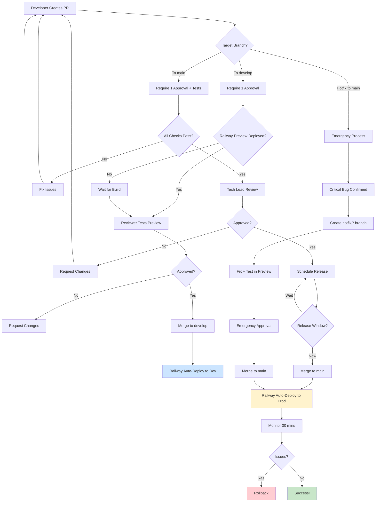

# Branch Protection & Approval Flow

## Description
Flowchart showing the approval gates and checks required for merging to different branches. This ensures code quality and stability through required reviews and automated checks.

## When to Reference
- Creating pull requests
- Understanding approval requirements
- Setting up branch protection rules
- Troubleshooting blocked merges

## Branch Protection Overview
ACS uses GitHub branch protection rules to enforce quality gates before code reaches stable branches.



## Branch Protection Rules

### Main Branch Protection

**Required Checks**:
- ✅ At least 1 approval from code owner
- ✅ All CI tests passing
- ✅ Railway preview deployed successfully
- ✅ No merge conflicts
- ✅ Linear history (rebase or squash merge)

**Who Can Approve**:
- Tech Lead (required)
- Senior Developers (optional second review)

**Who Can Merge**:
- Tech Lead only
- After approval and all checks pass

**Special Rules**:
- Restrict push to main (no direct commits)
- Require status checks to pass
- Dismiss stale reviews on new commits
- Require review from code owners

### Develop Branch Protection

**Required Checks**:
- ✅ At least 1 approval from team member
- ✅ Railway preview deployed successfully
- ✅ No merge conflicts

**Who Can Approve**:
- Any team member
- QA team members
- Tech Lead

**Who Can Merge**:
- PR author (after approval)
- Tech Lead
- QA Team Lead

**Special Rules**:
- Require pull request reviews
- Allow force push by admins (for emergency fixes)
- Require branches to be up to date

### Feature Branches

**Required Checks**:
- None (developer freedom)

**Protection**:
- No protection (temporary branches)
- Deleted after merge

**Best Practices**:
- Keep branches short-lived (< 1 week)
- Sync with develop regularly
- Small, focused changes

## Pull Request Types

### 1. Feature PR (feature/* → develop)

**Process**:
1. Create PR with descriptive title
2. Wait for Railway preview build
3. Test feature in preview environment
4. Request review from QA or peer
5. Address feedback
6. Get approval
7. Squash and merge

**Timeline**: 1-2 days typical

**Requirements**:
- Clear PR description
- Link to issue/ticket
- Screenshots if UI changes
- Test results if backend changes

### 2. Release PR (develop → main)

**Process**:
1. Code freeze announced (Friday)
2. QA completes testing in Dev
3. Create release PR with version bump
4. Update CHANGELOG.md
5. Tech Lead final review
6. Schedule release window (Monday)
7. Merge during release window
8. Monitor production deployment

**Timeline**: 3 days (Friday create → Monday merge)

**Requirements**:
- Completed QA sign-off
- Updated version number
- Complete changelog
- Release notes drafted
- All tests passing

### 3. Hotfix PR (hotfix/* → main)

**Process**:
1. Critical bug identified
2. Create hotfix branch from main
3. Implement minimal fix
4. Test in preview environment
5. Emergency review (< 30 minutes)
6. Merge immediately
7. Monitor production closely
8. Backport to develop

**Timeline**: < 2 hours total

**Requirements**:
- Confirmed critical severity
- Tech Lead approval
- Testing in preview
- Rollback plan ready

## Approval Guidelines

### What Reviewers Check

**Code Quality**:
- Follows coding standards
- No obvious bugs or issues
- Proper error handling
- Efficient algorithms

**Testing**:
- Test in Railway preview
- Verify functionality works
- Check edge cases
- Regression testing

**Documentation**:
- Code comments where needed
- README updated if needed
- API docs updated if changed

**Security**:
- No hardcoded secrets
- Proper input validation
- No SQL injection risks
- Authentication/authorization correct

### Approval Checklist

**For Feature PRs**:
- [ ] Code reviewed
- [ ] Tested in Railway preview
- [ ] No merge conflicts
- [ ] Tests passing
- [ ] Documentation updated
- [ ] Ready to merge to develop

**For Release PRs**:
- [ ] All features tested in Dev
- [ ] QA sign-off received
- [ ] CHANGELOG updated
- [ ] Version bumped
- [ ] Release notes complete
- [ ] Deployment plan reviewed
- [ ] Rollback plan confirmed

**For Hotfix PRs**:
- [ ] Critical bug confirmed
- [ ] Minimal changes only
- [ ] Tested in preview
- [ ] Tech Lead notified
- [ ] Deployment monitored
- [ ] Backport plan confirmed

## Automated Checks

### GitHub Actions CI
```yaml
# Runs on all PRs
- Backend tests (Jest)
- Frontend tests (Vitest)
- Linting (ESLint)
- Type checking (TypeScript)
- Build validation
```

**Status**: Must pass before merge

### Railway Deployment Check
```yaml
# Runs on all PRs
- Preview environment built
- Services started successfully
- Health checks passing
```

**Status**: Must pass before merge

### CodeQL Security Scan
```yaml
# Runs on all PRs
- Security vulnerability scanning
- Code quality analysis
- Dependency vulnerability check
```

**Status**: Advisory (doesn't block merge)

## Merge Strategies

### Squash and Merge (Default for Features)
**Used For**: feature/* → develop

**Benefits**:
- Clean history
- One commit per feature
- Easy to revert
- Simple changelog

**How It Works**:
1. All commits in PR squashed into one
2. Commit message from PR title
3. PR description becomes commit body

### Rebase and Merge (Release PRs)
**Used For**: develop → main

**Benefits**:
- Linear history
- Preserves individual commits
- Clear feature boundaries

**How It Works**:
1. Commits from develop replayed on main
2. No merge commit created
3. Clean, linear history

### Emergency Merge (Hotfixes Only)
**Used For**: hotfix/* → main (critical only)

**Benefits**:
- Fastest merge possible
- Can bypass some checks
- Tech Lead approval sufficient

**How It Works**:
1. Manual override by Tech Lead
2. Merge commit created
3. Immediate deployment

## Conflict Resolution

### Handling Merge Conflicts

**In Feature PR**:
1. Sync with develop: `git pull origin develop`
2. Resolve conflicts locally
3. Test locally after resolving
4. Push resolution
5. Railway rebuilds preview

**In Release PR**:
1. Should be rare (develop ahead of main)
2. Review changes carefully
3. Involve Tech Lead
4. Test in Dev after resolving

**In Hotfix**:
1. Minimize conflicts by starting from main
2. Resolve quickly
3. Test thoroughly
4. Deploy immediately

## Bypassing Protection

### When Allowed
- **Emergency**: Critical production issue
- **Authorized By**: Tech Lead only
- **Documentation**: Must document reason
- **Review**: Post-merge review required

### How to Bypass
1. GitHub → Settings → Branches
2. Temporarily disable protection
3. Perform emergency merge
4. Re-enable protection immediately
5. Schedule post-mortem

### Never Bypass For
- Regular features
- Non-critical bugs
- Convenience
- Skipping reviews

## Metrics & Monitoring

### PR Metrics
- **Time to First Review**: Target < 4 hours
- **Time to Merge**: Target < 2 days
- **Review Comments**: Average 3-5 per PR
- **Approval Rate**: Target > 95%

### Quality Metrics
- **Revert Rate**: Target < 2%
- **Hotfix Frequency**: Target < 1 per month
- **Test Coverage**: Target > 80%
- **Build Success Rate**: Target > 95%

## Related Diagrams
- [Feature Development Workflow](02-feature-development-workflow.md) - Full development process
- [Hotfix Workflow](03-hotfix-workflow.md) - Emergency procedures
- [Deployment Decision Tree](08-deployment-decision-tree.md) - When to deploy
