# Deployment Decision Tree

## Description
Decision tree for determining the correct deployment path based on change type. This helps developers and team leads choose the appropriate workflow for different types of changes.

## When to Reference
- Planning a code change
- Deciding deployment urgency
- Training new team members
- Resolving deployment questions

## Decision Philosophy
Not all changes require the same deployment path. Use this tree to find the fastest safe path to production.

```mermaid
graph TD
    Start[Code Change Ready] --> Q1{Change Type?}
    
    Q1 -->|New Feature| F1[Merge to develop first]
    Q1 -->|Bug Fix| F2[Is it breaking production?]
    Q1 -->|Dependency Update| F3[Test in dev environment]
    Q1 -->|Config Change| F4[Environment-specific?]
    
    F1 --> F1A[Deploy to Dev]
    F1A --> F1B{QA Pass?}
    F1B -->|No| F1C[Fix in develop]
    F1B -->|Yes| F1D[Wait for release window]
    F1C --> F1A
    F1D --> F1E[Merge to main]
    F1E --> Deploy[Deploy to Production]
    
    F2 -->|Yes - Critical| F2A[Create hotfix branch]
    F2 -->|No| F1
    F2A --> F2B[Fix + test in preview]
    F2B --> F2C[Emergency merge to main]
    F2C --> Deploy
    
    F3 --> F3A[Deploy to dev]
    F3A --> F3B{Any issues?}
    F3B -->|Yes| F3C[Investigate/Rollback]
    F3B -->|No| F3D[Wait 24 hours]
    F3D --> F3E[Merge to main]
    F3E --> Deploy
    
    F4 -->|Yes| F4A[Update Railway vars]
    F4 -->|No| F4B[Update in code]
    F4A --> F4C{Which environment?}
    F4C -->|Prod| Deploy
    F4C -->|Dev| F1A
    F4B --> F1
    
    Deploy --> D1[Railway Auto-Deploy]
    D1 --> D2[Health Checks]
    D2 --> D3{Healthy?}
    D3 -->|Yes| D4[Monitor Metrics]
    D3 -->|No| D5[Auto Rollback]
    D4 --> D6{Issues in 30 min?}
    D6 -->|No| Success[✅ Deployment Complete]
    D6 -->|Yes| D7[Manual Rollback]
    D5 --> Alert[🚨 Alert Team]
    D7 --> Alert
    
    style Success fill:#c8e6c9
    style Alert fill:#ffcdd2
```

## Change Type Guide

### New Feature

**Definition**: New functionality that doesn't exist in the application

**Examples**:
- New page or component
- New API endpoint
- New integration
- UI improvements

**Deployment Path**:
1. Create feature branch
2. Test in PR preview
3. Merge to develop
4. QA in Dev environment
5. Wait for weekly release
6. Deploy to production Monday

**Timeline**: 3-7 days

**Risk Level**: Low-Medium (tested in multiple environments)

### Bug Fix (Non-Critical)

**Definition**: Fix for a bug that's not causing production issues

**Examples**:
- UI glitch that's not blocking users
- Minor calculation error
- Cosmetic issues
- Performance optimization

**Deployment Path**: Same as New Feature

**Timeline**: 3-7 days

**Risk Level**: Low (can wait for normal release)

### Bug Fix (Critical - Production Breaking)

**Definition**: Fix for a bug actively causing production issues

**Examples**:
- Service completely down
- Data corruption ongoing
- Security vulnerability being exploited
- Core feature completely broken

**Deployment Path**: Hotfix Workflow
1. Create hotfix branch from main
2. Minimal fix only
3. Test in preview
4. Emergency approval
5. Deploy immediately
6. Backport to develop

**Timeline**: 30 minutes - 2 hours

**Risk Level**: High (but necessary)

### Dependency Update

**Definition**: Updating npm packages or other dependencies

**Examples**:
- Security patch for dependency
- Minor version bump
- Major version upgrade

**Deployment Path**:
1. Update in develop branch
2. Deploy to Dev environment
3. Monitor for 24 hours
4. Run full test suite
5. Deploy to production in next release

**Special Cases**:
- **Critical Security Patch**: Use hotfix workflow
- **Major Version**: Extensive testing required
- **Minor Patch**: Can bundle with features

**Timeline**: 2-7 days

**Risk Level**: Medium (dependencies can have unexpected effects)

### Configuration Change

**Definition**: Changes to environment variables or settings

**Examples**:
- API keys rotation
- Feature flags
- Resource limits
- Environment-specific settings

**Deployment Path**:

**If Environment-Specific** (Railway variables):
1. Update in Railway dashboard
2. Restart services
3. Verify changes

**If Code-Based** (config files):
1. Update in develop
2. Test in Dev
3. Deploy with next release

**Timeline**: Minutes (env vars) or 3-7 days (code)

**Risk Level**: Low-Medium (test carefully)

## Severity Assessment

### Is It Critical?

Ask these questions:
1. **Is the service completely down?** → Yes = Critical
2. **Are users unable to complete core workflows?** → Yes = Critical
3. **Is data being corrupted or lost?** → Yes = Critical
4. **Is there an active security exploit?** → Yes = Critical
5. **Are 50%+ of users affected?** → Yes = Critical
6. **Can it wait until Monday?** → No = Critical

If **any** answer is "Critical" → Use Hotfix Workflow

### Testing Requirements by Risk Level

**Low Risk**:
- Test in PR preview
- Basic smoke testing
- QA can test in Dev

**Medium Risk**:
- Test in PR preview
- Comprehensive testing in Dev
- QA full test suite
- Monitor closely in production

**High Risk** (Hotfix):
- Test in PR preview
- Tech Lead review required
- Test specific issue resolution
- Active monitoring for 1 hour post-deploy

## Deployment Windows

### Normal Release Window
- **Day**: Monday morning
- **Time**: 9:00 AM - 11:00 AM
- **Frequency**: Weekly
- **Suitable For**: Features, non-critical bugs, dependency updates

### Emergency Window
- **Day**: Any day, any time
- **Time**: As soon as possible
- **Frequency**: Rare (< 1 per month)
- **Suitable For**: Critical production issues only

### Maintenance Window
- **Day**: Friday evening (if needed)
- **Time**: 6:00 PM - 8:00 PM
- **Frequency**: As needed
- **Suitable For**: Database maintenance, major migrations

## Special Scenarios

### Multiple Bug Fixes
**Question**: Fix several bugs at once or separately?

**Decision**:
- **Bundle** if all non-critical (normal release)
- **Separate** if any is critical (hotfix that one)
- **Coordinate** if fixes overlap

### Feature + Bug Fix
**Question**: Can we include a bug fix with a feature?

**Decision**:
- **Yes** if bug is non-critical
- **No** if bug is critical (hotfix separately)
- **Consider** impact on testing

### Breaking Changes
**Question**: How to deploy changes that break backward compatibility?

**Decision**:
1. Plan migration strategy
2. Test extensively in Dev
3. Coordinate with users
4. Deploy during low-traffic window
5. Have rollback plan ready
6. Monitor closely

### Database Migrations
**Question**: How to handle schema changes?

**Decision**:
- **Backward compatible**: Deploy with normal release
- **Breaking changes**: Plan carefully, deploy in maintenance window
- **Data migrations**: Test in Dev, backup production first
- **Rollback**: Ensure migrations are reversible

## Risk Mitigation

### Before Deployment

**Always**:
- [ ] Test in appropriate environment
- [ ] Have rollback plan
- [ ] Review change impact
- [ ] Get required approvals

**For Medium/High Risk**:
- [ ] Schedule during business hours
- [ ] Have team members on standby
- [ ] Prepare communication to users
- [ ] Review monitoring setup

### During Deployment

**Monitor**:
- Health check status
- Error rates
- Response times
- User reports

**Be Ready To**:
- Rollback immediately
- Debug production issues
- Communicate with stakeholders

### After Deployment

**Check**:
- All services healthy
- Error rates normal
- User workflows working
- Database integrity

**Monitor For**:
- 30 minutes minimum
- 2 hours for high-risk changes
- 24 hours for dependency updates

## Common Questions

### Q: Can I deploy on Friday?
**A**: Avoid if possible. If critical, use hotfix process. Otherwise, wait for Monday.

### Q: Do documentation changes need the full process?
**A**: No. Docs can be merged to main directly after review.

### Q: What if QA finds bugs Friday afternoon?
**A**: Either fix immediately (if quick) or remove feature from release.

### Q: Can I skip Dev environment?
**A**: No, except for hotfixes that test in PR preview instead.

### Q: What if the hotfix fails?
**A**: Rollback immediately, reassess, create new hotfix if needed.

## Metrics to Track

### Deployment Frequency
- **Target**: 1 normal release per week
- **Actual**: Track weekly
- **Hotfixes**: < 1 per month

### Deployment Success Rate
- **Target**: > 95% successful
- **Failed**: Track reasons
- **Rollbacks**: < 5%

### Time to Production
- **Normal**: 3-7 days
- **Hotfix**: < 2 hours
- **Track**: Average time per change type

## Related Diagrams
- [Feature Development Workflow](02-feature-development-workflow.md) - Normal feature path
- [Hotfix Workflow](03-hotfix-workflow.md) - Emergency process
- [Weekly Release Cycle](04-weekly-release-cycle.md) - Release schedule
- [Branch Protection & Approval](07-branch-protection-approval.md) - Approval requirements
