# Environment Promotion Flow

## Description
Shows how code is promoted through environments from local development to production. This diagram illustrates the complete journey of code through the ACS deployment pipeline.

## When to Reference
- Understanding the complete deployment flow
- Planning feature releases
- Troubleshooting environment issues
- Onboarding new developers

## Promotion Philosophy
Code progresses through multiple quality gates, each providing increasing confidence before reaching production users.

```mermaid
graph LR
    subgraph "Feature Development"
        A1[Local Dev] -->|git push| A2[Feature Branch]
        A2 -->|Create PR| A3[PR Preview Env]
        A3 -->|Test & Review| A4{Approved?}
        A4 -->|No| A1
        A4 -->|Yes| A5[Merge]
    end
    
    subgraph "Integration Testing"
        A5 --> B1[Develop Branch]
        B1 -->|Auto-Deploy| B2[Dev Environment]
        B2 -->|Run Tests| B3[Integration Tests]
        B3 -->|Manual QA| B4{Tests Pass?}
        B4 -->|No| B5[Bug Fix]
        B5 --> A1
        B4 -->|Yes| B6[QA Approval]
    end
    
    subgraph "Release Preparation"
        B6 --> C1[Code Freeze]
        C1 --> C2[Create Release PR]
        C2 --> C3[Final Review]
        C3 --> C4{Ready?}
        C4 -->|No| C5[Address Concerns]
        C5 --> B2
        C4 -->|Yes| C6[Approve Release]
    end
    
    subgraph "Production Deployment"
        C6 --> D1[Merge to Main]
        D1 -->|Auto-Deploy| D2[Production Env]
        D2 --> D3[Run Migrations]
        D3 --> D4[Health Check]
        D4 --> D5{Healthy?}
        D5 -->|No| D6[Rollback]
        D5 -->|Yes| D7[Monitor]
        D7 --> D8{Stable?}
        D8 -->|No| D9[Rollback]
        D8 -->|Yes| D10[✅ Success]
        D6 --> D11[Post-Mortem]
        D9 --> D11
    end
    
    subgraph "Post-Deployment"
        D10 --> E1[Tag Release]
        E1 --> E2[Update Changelog]
        E2 --> E3[Notify Users]
        E3 --> E4[Merge back to develop]
        E4 --> E5[Continue Development]
        E5 --> A1
    end

    style A3 fill:#fff3cd
    style B2 fill:#cce5ff
    style D2 fill:#c8e6c9
    style D6 fill:#ffcdd2
    style D9 fill:#ffcdd2
    style D10 fill:#4caf50
```



## Environment Stages

### Stage 1: Local Development

**Purpose**: Developer workspace for writing and testing code

**Environment**:
- Developer's local machine
- Node.js 22 LTS
- SQLite database (local)
- Hot reload enabled

**Quality Gates**:
- Code compiles without errors
- Local tests pass
- Manual testing by developer
- Passes linter checks

**Exit Criteria**:
- Developer satisfied with implementation
- Ready for code review
- Pushed to feature branch

### Stage 2: PR Preview Environment

**Purpose**: Isolated testing environment for pull requests

**Environment**:
- Railway ephemeral instance
- 256MB RAM per service
- Ephemeral SQLite database
- Unique URL: `acs-pr-{number}.up.railway.app`

**Quality Gates**:
- Successful build and deployment
- Health checks passing
- Code review approval
- Manual testing by reviewer

**Exit Criteria**:
- PR approved by reviewer
- All automated checks pass
- Ready to merge to develop

**Lifecycle**: Created on PR open, deleted on merge/close

### Stage 3: Development Environment

**Purpose**: Integration testing and QA validation

**Environment**:
- Railway persistent instance
- 512MB RAM per service
- PostgreSQL database (1GB)
- Fixed URL: `acs-dev.up.railway.app`

**Quality Gates**:
- All features integrated successfully
- Automated test suite passes
- QA comprehensive testing
- Regression testing complete

**Exit Criteria**:
- QA sign-off received
- No critical bugs found
- Ready for release

**Data**: Test data, can be reset if needed

### Stage 4: Production Environment

**Purpose**: Live application serving end users

**Environment**:
- Railway production instance
- 1GB RAM per service
- PostgreSQL database (5GB)
- Fixed URL: `kars.up.railway.app`

**Quality Gates**:
- Zero-downtime deployment
- Health checks passing
- No error rate increase
- Response times within SLA

**Exit Criteria**:
- Monitored for 30+ minutes
- No user-reported issues
- Metrics within normal range

**Data**: Live user data, backed up daily

## Promotion Triggers

### Local → Feature Branch
**Trigger**: Developer satisfaction
**Method**: `git push origin feature/branch-name`
**Automatic**: No
**Reversible**: Yes (delete branch)

### Feature Branch → PR Preview
**Trigger**: PR creation
**Method**: Automatic (Railway webhook)
**Automatic**: Yes
**Reversible**: N/A (deleted with PR)

### PR Preview → Develop
**Trigger**: PR approval and merge
**Method**: GitHub merge button
**Automatic**: Merge is manual, deploy is automatic
**Reversible**: Yes (revert commit)

### Develop → Dev Environment
**Trigger**: Push to develop branch
**Method**: Automatic (Railway webhook)
**Automatic**: Yes
**Reversible**: Yes (revert and redeploy)

### Dev → Release PR
**Trigger**: QA approval
**Method**: Manual PR creation
**Automatic**: No
**Reversible**: N/A (just PR)

### Release PR → Main
**Trigger**: Tech Lead approval
**Method**: GitHub merge button (scheduled)
**Automatic**: Merge is manual, deploy is automatic
**Reversible**: Yes (rollback or revert)

### Main → Production
**Trigger**: Merge to main
**Method**: Automatic (Railway webhook)
**Automatic**: Yes
**Reversible**: Yes (rollback via Railway)

## Data Considerations

### Local Development
- **Data Source**: Mock data or local database
- **Persistence**: Not important
- **Cleanup**: Developer responsibility

### PR Preview
- **Data Source**: Ephemeral database with seed data
- **Persistence**: Temporary (deleted with PR)
- **Cleanup**: Automatic on PR close

### Development
- **Data Source**: Persistent test database
- **Persistence**: Important for QA continuity
- **Cleanup**: Manual reset as needed
- **Backups**: Not critical

### Production
- **Data Source**: Production database
- **Persistence**: Critical
- **Cleanup**: Never! Only through proper procedures
- **Backups**: Daily automated + pre-deployment

## Quality Gates Summary

| Stage | Automated Tests | Manual Testing | Code Review | Approval Required |
|-------|----------------|----------------|-------------|-------------------|
| Local | Optional | Required | No | No |
| PR Preview | Yes | Required | Yes | 1 reviewer |
| Development | Yes | Required | N/A | QA sign-off |
| Production | Yes | Optional | N/A | Tech Lead |

## Timing Between Stages

| Transition | Typical Duration | Can Be Expedited? |
|------------|------------------|-------------------|
| Local → Feature | Minutes | N/A |
| Feature → PR Preview | 2-4 minutes | No (build time) |
| PR Preview → Develop | 1-2 days | Yes (fast review) |
| Develop → Dev Env | 3-5 minutes | No (build time) |
| Dev → Release PR | 1-3 days | No (QA required) |
| Release PR → Main | 3 days | Yes (hotfix only) |
| Main → Production | 3-5 minutes | No (build time) |

## Rollback Strategy

### PR Preview
**Method**: Create new commit
**Time**: Minutes
**Risk**: None (isolated environment)

### Development
**Method**: Revert commit and redeploy
**Time**: 5-10 minutes
**Risk**: Low (test environment)

### Production
**Method 1** (Preferred): Railway rollback to previous deployment
- Click "Rollback" in Railway dashboard
- Traffic switches in 30 seconds
- Previous version restored

**Method 2** (Alternative): Git revert
- Revert commit on main branch
- Railway auto-deploys revert
- Takes 3-5 minutes

**Time**: 30 seconds - 5 minutes
**Risk**: Low (tested rollback procedure)

## Environment Synchronization

### Keeping Environments In Sync

**Challenge**: Develop and Main can diverge

**Solution**: Regular maintenance
1. After each production release
2. Merge main back to develop
3. Ensures develop has all production fixes

```bash
# After production release
git checkout develop
git merge main
git push origin develop
```

### Handling Divergence

**Scenario**: Hotfix applied to main, not in develop

**Resolution**:
1. Immediately after hotfix
2. Merge main into develop
3. Or cherry-pick hotfix commit

**Prevention**: Always backport hotfixes

## Configuration Management

### Environment-Specific Configuration

**Method**: Railway environment variables

**Variables by Environment**:

**PR Preview**:
- `NODE_ENV=development`
- `DATABASE_URL=ephemeral`
- `LOG_LEVEL=debug`

**Development**:
- `NODE_ENV=development`
- `DATABASE_URL=persistent-dev`
- `LOG_LEVEL=debug`

**Production**:
- `NODE_ENV=production`
- `DATABASE_URL=persistent-prod`
- `LOG_LEVEL=info`

### Secrets Management

**Never Commit**:
- API keys
- Database passwords
- JWT secrets
- OAuth credentials

**Store In**:
- Railway environment variables
- Encrypted and access-controlled

## Monitoring Across Environments

### What to Monitor

**PR Preview**:
- Build success rate
- Deployment time
- Review time

**Development**:
- Test pass rate
- QA coverage
- Bug discovery rate

**Production**:
- Uptime (target: 99.9%)
- Error rate (target: < 0.1%)
- Response time (target: < 500ms)
- User satisfaction

### Alert Thresholds

**Development**: Informational only
**Production**: Critical alerts
- Error rate > 1%
- Response time > 2 seconds
- Memory > 90%
- CPU > 90%

## Best Practices

### For Developers
1. Test locally before pushing
2. Test in PR preview before requesting review
3. Keep PRs small and focused
4. Write clear commit messages

### For Reviewers
1. Test in PR preview, don't just read code
2. Check both happy path and edge cases
3. Verify documentation updates
4. Approve only when confident

### For QA
1. Test in Dev environment, not PR preview
2. Run full regression suite
3. Document all issues found
4. Only approve when ready for production

### For Tech Leads
1. Review release PRs carefully
2. Schedule releases during business hours
3. Be available during deployments
4. Make rollback decisions quickly if needed

## Related Diagrams
- [Complete CI/CD Flow](01-complete-cicd-flow.md) - Overall pipeline
- [Multi-Environment Deployment](05-multi-environment-deployment.md) - Environment details
- [Complete Release Workflow](10-complete-release-workflow.md) - Detailed sequence
