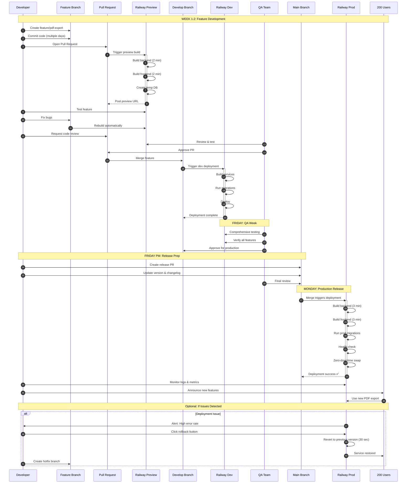

# Complete Release Workflow (Comprehensive)

## Description
Detailed sequence diagram showing the entire release process from feature development to production deployment. This is the most comprehensive view of the full ACS release lifecycle.

## When to Reference
- Understanding the complete release process
- Training new team members
- Planning multi-week features
- Coordinating with stakeholders

## Timeline Overview
This diagram spans approximately 1-2 weeks from feature start to production deployment, following the weekly release cycle.



## Detailed Phase Breakdown

### Phase 1: Feature Development (Monday - Thursday, Week 1-2)

**Duration**: 2-10 days depending on complexity

**Step 1-3: Create Feature Branch & Develop**
```bash
# Developer actions
git checkout develop
git pull origin develop
git checkout -b feature/pdf-export
# ... develop over several days ...
git commit -m "Add PDF export functionality"
git push origin feature/pdf-export
```

**Deliverables**:
- Working feature code
- Unit tests
- Documentation updates
- Clear commit history

### Phase 2: PR Preview & Self-Testing (1-2 days)

**Step 4-7: Open PR & Railway Auto-Build**

**PR Creation**:
- Developer opens PR on GitHub
- Fills out PR template:
  - Description of changes
  - Link to issue/ticket
  - Testing performed
  - Screenshots if UI changes

**Railway Actions** (Automatic):
1. Receives GitHub webhook
2. Builds backend service (2 minutes)
3. Builds frontend service (2 minutes)
4. Creates ephemeral database
5. Runs migrations
6. Seeds test data
7. Posts comment with preview URL

**Step 8-10: Self-Testing Cycle**
- Developer tests in preview environment
- Identifies bugs or improvements
- Makes additional commits
- Railway automatically rebuilds
- Repeat until satisfied

### Phase 3: Code Review (1-2 days)

**Step 11-13: Request & Perform Review**

**Developer**:
```bash
# Request review from team
# In GitHub: Reviewers → Select QA team member
```

**Reviewer**:
1. Opens preview URL
2. Tests feature functionality
3. Verifies edge cases
4. Checks code quality
5. Leaves feedback or approves

**Review Checklist**:
- [ ] Feature works as described
- [ ] No obvious bugs
- [ ] Code follows standards
- [ ] Tests included
- [ ] Documentation updated
- [ ] No security issues

### Phase 4: Integration (Thursday PM)

**Step 14-19: Merge to Develop**

**Merge Actions**:
1. Developer clicks "Squash and merge"
2. Railway receives webhook
3. Starts deployment to Dev environment

**Railway Deployment** (Automatic, ~5 minutes):
1. Builds both services
2. Runs database migrations
3. Performs health checks
4. Switches traffic when healthy
5. Notifies team of success

**Verification**:
- Check Dev environment is accessible
- Verify feature deployed correctly
- Confirm no errors in logs

### Phase 5: QA Testing (Friday AM)

**Step 20-22: Comprehensive QA**

**QA Process** (4 hours):
1. **Functional Testing**
   - Test new features
   - Verify acceptance criteria met
   - Test user workflows

2. **Regression Testing**
   - Ensure existing features still work
   - Check common user paths
   - Verify no unexpected changes

3. **Edge Case Testing**
   - Test boundary conditions
   - Invalid inputs
   - Error handling
   - Mobile responsiveness

4. **Automated Tests**
   ```bash
   npm test  # Run full test suite
   ```

**Step 23: QA Approval**
- QA documents findings
- Critical bugs must be fixed
- Minor issues logged for future
- Gives go/no-go decision

### Phase 6: Release Preparation (Friday PM)

**Step 24-26: Create Release PR**

**Actions**:
```bash
# Create release PR
git checkout main
git pull origin main
git checkout -b release/v1.5.0
git merge origin/develop

# Update version
npm version minor  # Updates package.json to 1.5.0

# Update changelog
# Edit CHANGELOG.md with new features

git commit -am "Release v1.5.0"
git push origin release/v1.5.0
```

**PR Description Template**:
```markdown
# Release v1.5.0

## New Features
- PDF export functionality (#123)
- User profile improvements (#124)

## Bug Fixes
- Fixed asset search (#125)

## QA Sign-Off
- [x] All features tested
- [x] Regression tests passed
- [x] No critical bugs

## Deployment Plan
- Deploy Monday 9:30 AM
- Monitor for 2 hours
- Announce to users at 11:00 AM
```

### Phase 7: Production Deployment (Monday AM)

**Step 27-34: Deploy to Production**

**Pre-Deployment** (9:00 AM):
- Tech Lead reviews release PR
- Team on standby
- Monitoring dashboards open

**Merge & Deploy** (9:30 AM):
1. Tech Lead merges release PR
2. Railway receives webhook
3. Begins production deployment

**Railway Production Deployment** (~8 minutes):
1. **Build Phase** (3 minutes)
   - Build backend with production optimizations
   - Build frontend with minification
   - Cache dependencies

2. **Pre-Deployment** (2 minutes)
   - Take database snapshot
   - Verify environment variables
   - Run pre-deployment checks

3. **Migration Phase** (1 minute)
   - Run production migrations
   - Verify schema changes
   - Rollback available if fails

4. **Deployment Phase** (2 minutes)
   - Start new backend instance
   - Start new frontend instance
   - Run health checks
   - Keep old instances running

5. **Health Checks** (pass/fail):
   ```
   GET /api/health
   - Response: 200 OK
   - Database: Connected
   - Services: All healthy
   ```

6. **Traffic Switch**:
   - Zero-downtime swap
   - Old instances available for rollback
   - New instances serve traffic

**Step 35: Deployment Success**
- Railway confirms deployment
- Slack notification sent
- Team proceeds to monitoring

### Phase 8: Post-Deployment (Monday AM - End of Day)

**Step 36-38: Monitor & Announce**

**Monitoring** (9:40 AM - 11:00 AM):
```bash
# Monitor logs
railway logs --service backend --environment production

# Check metrics
- Error rate: Should be < 0.1%
- Response time: Should be < 500ms
- Memory usage: Should be < 80%
- CPU usage: Should be < 80%
```

**Verification Checklist**:
- [ ] All services responding
- [ ] No error spikes in logs
- [ ] Response times normal
- [ ] Database queries performing well
- [ ] User reports positive

**Announcement** (11:00 AM):
```markdown
# To: All Users
# Subject: New Features Available

We've just released version 1.5.0 with:
- PDF export for asset reports
- Improved user profiles
- Various bug fixes

Try out the new features and let us know what you think!
```

**Step 39: User Adoption**
- Users start using new features
- Team monitors feedback
- Support team ready for questions

### Phase 9: Issue Response (If Needed)

**Step 40-45: Rollback Procedure**

**Trigger**: High error rate detected

**Response** (< 5 minutes):
1. **Alert**: Monitoring detects issue
2. **Assess**: Tech Lead evaluates severity
3. **Decide**: Rollback vs. fix forward
4. **Execute**: Click rollback in Railway
5. **Verify**: Previous version restored
6. **Communicate**: Notify users and team

**Rollback Process**:
```bash
# Via Railway Dashboard
1. Go to Production environment
2. Click "Deployments"
3. Find previous deployment
4. Click "Rollback to this deployment"
5. Confirm action
# Traffic switches in 30 seconds
```

**Post-Rollback**:
- Investigate root cause
- Create hotfix if needed
- Schedule post-mortem
- Update runbook

## Key Metrics

### Timeline Metrics
| Phase | Target | Actual (Track) |
|-------|--------|----------------|
| Feature Development | 2-5 days | ___ days |
| PR Review | 1-2 days | ___ days |
| QA Testing | 4 hours | ___ hours |
| Production Deploy | 8 minutes | ___ minutes |
| Monitoring Period | 2 hours | ___ hours |

### Quality Metrics
| Metric | Target | Actual (Track) |
|--------|--------|----------------|
| Deployment Success Rate | > 95% | ___% |
| Rollback Rate | < 5% | ___% |
| Time to Production | 7 days | ___ days |
| QA Bug Discovery | Document all | ___ bugs |

## Success Criteria

### Feature Complete
- [ ] All acceptance criteria met
- [ ] Tests passing
- [ ] Documentation updated
- [ ] Code reviewed and approved

### QA Approved
- [ ] Functional testing passed
- [ ] Regression testing passed
- [ ] No critical bugs
- [ ] Performance acceptable

### Production Deployed
- [ ] Deployment successful
- [ ] Health checks passing
- [ ] No errors in logs
- [ ] Users can access new features

### Stable Release
- [ ] Monitored for 2+ hours
- [ ] Error rate normal
- [ ] User feedback positive
- [ ] No rollback needed

## Communication Plan

### Daily Standups
- Feature progress updates
- Blocker identification
- Timeline adjustments

### Friday Status
- QA results shared
- Release decision made
- Deployment plan confirmed

### Monday Morning
- Team on call confirmed
- Deployment window announced
- Stakeholders notified

### Post-Deployment
- Success announcement
- User communication
- Metrics shared with team

## Related Diagrams
- [Feature Development Workflow](02-feature-development-workflow.md) - Developer focus
- [Weekly Release Cycle](04-weekly-release-cycle.md) - Schedule overview
- [Environment Promotion](09-environment-promotion.md) - Environment flow
- [Monitoring & Rollback](11-monitoring-rollback.md) - Post-deployment
