# Monitoring & Rollback Decision Flow

## Description
Decision tree for monitoring post-deployment metrics and determining when to rollback. This diagram helps teams make quick decisions during the critical post-deployment monitoring period.

## When to Reference
- During production deployments
- When unexpected behavior occurs
- Training on-call engineers
- Creating incident response procedures

## Monitoring Philosophy
Proactive monitoring with clear thresholds enables fast rollback decisions, minimizing user impact.

```mermaid
graph TD
    Start[Deployment Complete] --> Monitor[Monitor for 30 minutes]
    
    Monitor --> Check1{Error Rate?}
    Check1 -->|< 1%| Check2
    Check1 -->|> 1%| Alert1[🚨 High Error Rate]
    
    Check2{Response Time?}
    Check2 -->|< 500ms| Check3
    Check2 -->|> 500ms| Alert2[🚨 Slow Response]
    
    Check3{Memory Usage?}
    Check3 -->|< 80%| Check4
    Check3 -->|> 80%| Alert3[🚨 High Memory]
    
    Check4{CPU Usage?}
    Check4 -->|< 80%| Check5
    Check4 -->|> 80%| Alert4[🚨 High CPU]
    
    Check5{User Reports?}
    Check5 -->|None| Success[✅ Deployment Stable]
    Check5 -->|Multiple| Alert5[🚨 User Issues]
    
    Alert1 --> Severity1{Severity?}
    Alert2 --> Severity1
    Alert3 --> Severity1
    Alert4 --> Severity1
    Alert5 --> Severity1
    
    Severity1 -->|Critical| Immediate[Rollback Immediately]
    Severity1 -->|High| Evaluate[Evaluate for 5 min]
    Severity1 -->|Medium| Monitor2[Continue Monitoring]
    
    Evaluate --> Decision{Improving?}
    Decision -->|No| Immediate
    Decision -->|Yes| Monitor2
    
    Monitor2 --> Recheck{Still Issues?}
    Recheck -->|Yes| Immediate
    Recheck -->|No| Success
    
    Immediate --> RB1[Railway Dashboard]
    RB1 --> RB2[Select Previous Deployment]
    RB2 --> RB3[Click Redeploy]
    RB3 --> RB4[Traffic Switches in 30s]
    RB4 --> RB5[Verify Rollback]
    RB5 --> PostMortem[Schedule Post-Mortem]
    
    Success --> Tag[Tag Release v1.X.0]
    Tag --> Changelog[Update Changelog]
    Changelog --> Notify[Notify Stakeholders]
    Notify --> Done[✅ Release Complete]
    
    style Success fill:#c8e6c9
    style Done fill:#4caf50
    style Immediate fill:#ffcdd2
    style PostMortem fill:#fff3cd
```



## Monitoring Checklist

### Immediate Post-Deployment (0-5 minutes)

**System Health**:
- [ ] All services responding to health checks
- [ ] No 5xx errors in logs
- [ ] Database connections stable
- [ ] Memory usage normal (< 80%)
- [ ] CPU usage normal (< 80%)

**Basic Functionality**:
- [ ] Homepage loads
- [ ] Login works
- [ ] API endpoints responding
- [ ] Database queries executing

**Quick Smoke Test**:
```bash
# Test critical endpoints
curl https://kars.up.railway.app/api/health
curl https://kars.up.railway.app/api/assets
# Should return 200 OK
```

### Short-Term Monitoring (5-30 minutes)

**Performance Metrics**:
- [ ] Response times < 500ms average
- [ ] Error rate < 1%
- [ ] Memory stable or decreasing
- [ ] CPU usage reasonable

**User Experience**:
- [ ] Test user workflows
- [ ] Check new features work
- [ ] Verify existing features unaffected

**Log Analysis**:
```bash
# Watch for errors
railway logs --service backend --environment production | grep ERROR

# Check response times
railway logs --service backend --environment production | grep "ms"
```

### Extended Monitoring (30-120 minutes)

**Trend Analysis**:
- [ ] No gradual degradation
- [ ] Memory not climbing
- [ ] Error rate not increasing
- [ ] Response times stable

**User Reports**:
- [ ] No support tickets about errors
- [ ] No complaints in Slack
- [ ] Positive feedback on new features

## Metric Thresholds

### Error Rate

| Threshold | Status | Action |
|-----------|--------|--------|
| < 0.1% | Excellent | Continue monitoring |
| 0.1% - 1% | Normal | Watch closely |
| 1% - 5% | Warning | Investigate immediately |
| > 5% | Critical | Rollback |

**How to Check**:
```bash
# Count errors in last 5 minutes
railway logs --since 5m | grep -c "ERROR"
# Compare to total requests
```

### Response Time

| Threshold | Status | Action |
|-----------|--------|--------|
| < 200ms | Excellent | Continue monitoring |
| 200-500ms | Normal | Watch closely |
| 500-2000ms | Warning | Investigate immediately |
| > 2000ms | Critical | Consider rollback |

**How to Check**:
```bash
# Sample response times
for i in {1..10}; do
  time curl https://kars.up.railway.app/api/health
done
```

### Memory Usage

| Threshold | Status | Action |
|-----------|--------|--------|
| < 60% | Excellent | Continue monitoring |
| 60-80% | Normal | Watch closely |
| 80-90% | Warning | Investigate immediately |
| > 90% | Critical | Likely rollback |

**How to Check**:
- Railway Dashboard → Metrics tab
- Memory usage graph
- Look for upward trend

### CPU Usage

| Threshold | Status | Action |
|-----------|--------|--------|
| < 50% | Excellent | Continue monitoring |
| 50-80% | Normal | Watch closely |
| 80-90% | Warning | Investigate immediately |
| > 90% | Critical | Likely rollback |

**How to Check**:
- Railway Dashboard → Metrics tab
- CPU usage graph
- Check for sustained high usage

## Severity Assessment

### Critical (Rollback Immediately)

**Indicators**:
- ❌ Service completely unresponsive
- ❌ Error rate > 10%
- ❌ Data corruption occurring
- ❌ Security vulnerability exposed
- ❌ All users affected

**Response Time**: < 2 minutes

**Action**: Rollback without investigation

### High (Evaluate Then Decide)

**Indicators**:
- ⚠️ Error rate 5-10%
- ⚠️ Response time > 2 seconds
- ⚠️ Memory > 90% and climbing
- ⚠️ 50%+ users affected

**Response Time**: 5 minutes evaluation

**Action**: 
1. Quick investigation
2. If improving → monitor
3. If not improving → rollback

### Medium (Continue Monitoring)

**Indicators**:
- ⚠️ Error rate 1-5%
- ⚠️ Response time 500-2000ms
- ⚠️ Memory 80-90%
- ⚠️ < 25% users affected

**Response Time**: 15 minutes observation

**Action**:
1. Extend monitoring
2. Investigate root cause
3. Prepare rollback plan
4. If worsens → rollback

## Rollback Procedures

### Method 1: Railway Dashboard Rollback (Preferred)

**Steps**:
1. Log into Railway dashboard
2. Navigate to Production environment
3. Click "Deployments" tab
4. Find previous successful deployment
5. Click "..." menu → "Rollback to this deployment"
6. Confirm action

**Timeline**: 30-60 seconds total

**Result**: Traffic immediately switches to previous version

### Method 2: Git Revert (If Dashboard Unavailable)

**Steps**:
```bash
# Identify bad commit
git log --oneline

# Revert the merge
git revert -m 1 <merge-commit-sha>

# Push to trigger redeploy
git push origin main
```

**Timeline**: 3-5 minutes (includes build time)

**Result**: Railway deploys reverted code

### Post-Rollback Actions

**Immediate** (< 5 minutes):
- [ ] Verify rollback successful
- [ ] Check services healthy
- [ ] Monitor error rates
- [ ] Notify team and users

**Short-Term** (< 1 hour):
- [ ] Investigate root cause
- [ ] Document incident
- [ ] Communicate with stakeholders
- [ ] Plan corrective action

**Follow-Up** (< 24 hours):
- [ ] Schedule post-mortem
- [ ] Update runbooks
- [ ] Implement preventive measures
- [ ] Test fix before redeploying

## Monitoring Tools

### Railway Dashboard

**Access**: `railway.app`

**Metrics Available**:
- CPU usage over time
- Memory usage over time
- Request count
- Deployment history
- Service logs

**Refresh**: Auto-refresh every 10 seconds

### Application Logs

**Access**:
```bash
# Real-time logs
railway logs --service backend --environment production -f

# Last 100 lines
railway logs --service backend --environment production --tail 100

# Filter for errors
railway logs --service backend --environment production | grep ERROR
```

**What to Watch**:
- Error messages
- Warning signs
- Stack traces
- Slow query logs

### External Monitoring (Optional)

**Tools**:
- UptimeRobot (uptime monitoring)
- Sentry (error tracking)
- LogRocket (session replay)
- Google Analytics (user behavior)

## Communication During Incidents

### Immediate Communication (< 5 minutes)

**To**: Development team
**Channel**: Slack #dev-alerts
**Message**:
```
🚨 Production Issue Detected
Deployment: v1.5.0
Issue: High error rate (7%)
Action: Investigating
Status: Considering rollback
```

### Rollback Communication (< 10 minutes)

**To**: Development team + stakeholders
**Channel**: Slack #dev-alerts
**Message**:
```
🔄 Production Rollback Initiated
Previous: v1.5.0
Current: v1.4.9 (rolled back)
Reason: High error rate
Status: Services stable
Next: Post-mortem scheduled
```

### User Communication (< 30 minutes)

**To**: All users (if they noticed)
**Channel**: In-app notification / email
**Message**:
```
We experienced a brief issue with our latest update 
and have restored service. Everything is now working 
normally. We apologize for any inconvenience.
```

## False Positive Handling

### Common False Positives

**Temporary Spike**:
- Normal during initial deployment
- Wait 2-3 minutes for stabilization
- Don't rollback immediately

**Slow First Request**:
- Cold start after deployment
- Normal for first 1-2 requests
- Not a rollback trigger

**One-Off Error**:
- Single error in logs
- May be unrelated to deployment
- Monitor for pattern

### How to Verify Real Issue

**Check Multiple Sources**:
1. Logs from multiple instances
2. Multiple metric types
3. User reports confirmation
4. Pattern over time (not just snapshot)

**Wait for Confirmation**:
- 2-3 data points showing issue
- 2-5 minutes of sustained problem
- Multiple users affected

## Success Criteria

### Deployment Considered Successful When:

**After 30 Minutes**:
- [ ] Error rate < 1%
- [ ] Response time < 500ms
- [ ] Memory < 80%
- [ ] CPU < 80%
- [ ] No user complaints

**After 2 Hours**:
- [ ] All metrics stable
- [ ] New features working
- [ ] No degradation trend
- [ ] Positive user feedback

**After 24 Hours**:
- [ ] Performance metrics normal
- [ ] No related support tickets
- [ ] User adoption of new features
- [ ] Team confident in release

### Release Completion Actions

**Tag Release**:
```bash
git tag -a v1.5.0 -m "Release v1.5.0"
git push origin v1.5.0
```

**Update Changelog**:
- Document new features
- List bug fixes
- Note breaking changes

**Notify Stakeholders**:
- Send release announcement
- Update status page
- Post in user community

## Related Diagrams
- [Complete CI/CD Flow](01-complete-cicd-flow.md) - Full pipeline
- [Complete Release Workflow](10-complete-release-workflow.md) - Release process
- [Hotfix Workflow](03-hotfix-workflow.md) - Emergency response
